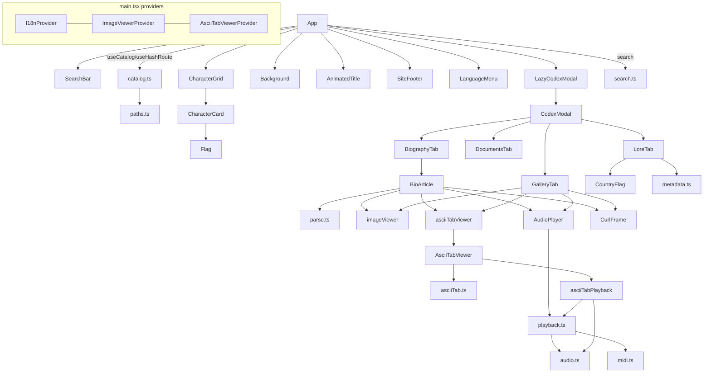

# 13 · `app/` — Code Map & Control/Data Flow (2026-07-21)

> Navigational companion to [`12-app-architecture.md`](12-app-architecture.md).
> "Where does X live and how does control reach it?" Pair with
> [`14-app-patterns-and-gotchas.md`](14-app-patterns-and-gotchas.md) (how to work
> here) and [`15-app-critique.md`](15-app-critique.md) (what's weak / backlog).
> All paths are repo-relative; line numbers drift — treat them as anchors.

## Layered architecture (bottom → top)

```
main.tsx  ─ providers: LazyMotion(strict) › I18nProvider › ImageViewerProvider › AsciiTabViewerProvider › App
App.tsx   ─ single orchestrator: catalog load, search/filter state, hash route, audio toggles, body scroll-lock, codex mount
  ├─ Data/content layer   catalog.ts · paths.ts · types.ts · metadata.ts · languages.ts · hooks.ts
  ├─ Search + i18n        search.ts · i18n.tsx · messages/* · languages.ts
  ├─ BioMD render         biomd/{parse.ts, remarkHighlight.ts, BioArticle.tsx}
  ├─ Audio                audio.ts · playback.ts · midi.ts · asciiTabPlayback.ts · AudioPlayer.tsx
  ├─ Overlays (viewers)   imageViewer.tsx+ImageViewer.tsx · asciiTabViewer.tsx+AsciiTabViewer.tsx · asciiTab.ts
  ├─ Browse UI            CharacterGrid · CharacterCard · SearchBar · AnimatedTitle · Background · SiteFooter · LanguageMenu
  ├─ Codex modal          codex/{CodexModal, BiographyTab, GalleryTab, DocumentsTab, LoreTab}
  └─ Shared UI atoms      OrnateFrame · Flag · CountryFlag · CurlFrame · placeholder.ts · index.css
```

**Philosophy (the through-line):** the app is a *pure renderer* — **all** content lives outside it in `../pages/` (mounted as Vite `publicDir`) and is fetched at runtime; nothing is bundled. It is a faithful, i18n-first re-creation of the legacy `guitar-times.ru`/`abc-guitars.com` site as an antique-manuscript "RPG codex," engineered for low-end devices (lazy chunks, idle prefetch, no canvas), with **deterministic per-entry identity** (theme/accent/placeholder all seeded from the slug) and **graceful degradation everywhere** (unknown blocks render, missing data → absent rows, failed fetch → soft-null, broken img → hidden/placeholder).

## File inventory by layer

### Entry & orchestration
| File | Role / key exports |
|---|---|
| `src/main.tsx` | Root render + provider nesting (see above). `LazyMotion features={domAnimation} strict` → only `m.*` allowed, no full `motion.*`. |
| `src/App.tsx` | The one orchestrator. Owns: query/filter state, `useCatalog`, `useHashRoute`, `useAudioUnlock`, sound/ambient toggles, **body scroll-lock (single owner — do not move to the modal)**, native/foreign result split + `nativeCount`, `turnPage` (← →), `navigateByMdPath` (cross-entry links). Mounts `LazyCodexModal` under `Suspense`+`AnimatePresence`. |
| `src/index.css` | Tailwind v4 `@theme` tokens + all semantic CSS (`.parchment`, `.ornate-border`, `.btn-rpg`, `.bio-article`, `.fx-curl`, footer chrome, keyframes). **~700 lines, unlayered → beats Tailwind utilities (footgun).** |
| `index.html` | Static shell, `lang="ru"`, inline "Кодекс открывается…" fallback, ❧ emoji-SVG favicon. No SSR. |

### Data / content layer
| File | Role |
|---|---|
| `src/lib/catalog.ts` | Fetch + cache. `loadIndex()` (throws on fail, refetchable), `loadEntry(entry,lang)` (per-`slug::lang`, soft-null), `prefetchAll()` (idle, save-data-aware, serial JSON warm). Three module-level **promise** caches. |
| `src/lib/paths.ts` | **Two independent bases**: `APP_BASE`(`import.meta.env.BASE_URL`) for index.json + its json/md/img via `resolveContentPath`; `RESOURCE_BASE_PATH`(`VITE_RESOURCE_BASE_PATH ?? "/pages"`) for in-entry media/docs via `resolveResourcePath`. `localizeContentPath` (json/md only), `slugOf` (from md filename), `isExternalUrl`. |
| `src/lib/types.ts` | `IndexEntry` (index.json row; free-text `country`, no `id`), `EntryMeta` (bio.json; ISO `country`), `EntryData`, `EntryBundle`, `MediaItem`, `DocumentItem`. |
| `src/lib/metadata.ts` | DMY dates (`parseDmy`/`formatDmy`/`yearOf`/`ageOf` — **never `new Date(str)`**), `splitList`, country display/ISO (`countryDisplay`/`resolveCountry`/`resolveCountryCode` + `COUNTRY_TEXT_TO_ISO`), `rankStars`, `fnv1a`, `accentFor`. |
| `src/lib/languages.ts` | `LANGUAGES` (curated order, `ru` 8th), `Lang`, `DEFAULT_LANG="ru"`, `entryLangs`/`parseLangList`/`pickContentLang`, `langInfo`. |
| `src/lib/hooks.ts` | `useAudioUnlock` (gesture unlock), `useCatalog(lang)` (load + ranking prefetch), `useHashRoute` (`#/slug`; slug regex `[\w-]+` = Latin only). |

### BioMD parser / renderer
| File | Role |
|---|---|
| `src/lib/biomd/parse.ts` | Recursive-descent `::: block` fence parser over line-segmented text → `BioDoc {title,nodes,warnings}`. Tolerant: unknown/stray/unclosed → preserved + warned. |
| `src/lib/biomd/remarkHighlight.ts` | remark plugin: `==text==` → `<mark>` via mdast `data.hName`. Can't span lines / contain `=`. |
| `src/lib/biomd/BioArticle.tsx` | react-markdown (GFM + highlight) renderer + **link-rewiring hub** (bio.md→in-app nav, audio→player, .txt→tab viewer, image→zoom viewer, external→new tab, else archival). Renders `Figure`/`images`/`DocumentCard`. Wraps images in `CurlFrame`. |

### Search & i18n
| File | Role |
|---|---|
| `src/lib/search.ts` | Client-side name filter. `buildSearchDoc` (4 folded haystacks + `langs`), `fold` (NFD + ё→е), `translitVariants` (query-side CYR→LAT, capped 64), `searchEntries` (exact-Set facets + AND token match). **No ranking; ordering lives in App.tsx.** |
| `src/lib/i18n.tsx` | `I18nProvider`/`useI18n`/`t`. `detectLang` (localStorage `codex-lang` → navigator → `ru`), `Intl.PluralRules`, `{k}` interpolation, fallback `lang→en→ru→key`. |
| `src/lib/messages/ru.ts` | **Source of truth**: `satisfies Record<string,Message>` + `export type MsgKey = keyof typeof ru`. |
| `src/lib/messages/{en,es,ja,de,fr,it,pt,zh,ko}.ts` | Typed `Record<MsgKey,Message>` → missing/extra keys = compile error. |
| `src/lib/messages/{types,index}.ts` | `Message`/`Plural` types; `DICTS` map (adding a `Lang` w/o dict = compile error). |

### Audio (all runtime-synthesised; only user mp3/wav/midi are files)
| File | Role |
|---|---|
| `src/lib/audio.ts` | Singleton `audio` (`AudioEngine`): one-shot SFX, ambient bed (I–V–vi–IV loop), per-entry deterministic **theme** (`themeFromSeed`). Own `AudioContext` + master→limiter→destination + convolver "room". |
| `src/lib/playback.ts` | `useAudioPlayback(src,kind)` over `NativeBackend`(HTMLAudio) / `MidiBackend`. `audioKind()`. **Single-active coordinator** (`claimPlayback`/`stopAllPlayback`, module-level `stopActive`) — keys on stop-callback reference identity. |
| `src/lib/midi.ts` | `loadMidi` (lazy `@tonejs/midi`, per-URL cache, soft-null) + `MidiPlayer` (own context, look-ahead scheduler). |
| `src/lib/asciiTabPlayback.ts` | `useAsciiTabPlayback` — oscillator preview from tab data (own context; approximate). |
| `src/components/AudioPlayer.tsx` | Presentational `AudioPlayer`/`InlineAudioPlayer` over `useAudioPlayback`. |

### Overlays / viewers (twin provider pattern)
| File | Role |
|---|---|
| `src/lib/imageViewer.tsx` | `ImageViewerProvider`/`useImageViewer`/`isImageUrl`. Holds one `ViewerImage|null`, mounts `LazyImageViewer key={src}`. |
| `src/components/ImageViewer.tsx` | Full-screen zoom/pan/rotate/1:1/download viewer. |
| `src/lib/asciiTabViewer.tsx` | `AsciiTabViewerProvider`/`useAsciiTabViewer` — same shape as image viewer. |
| `src/lib/asciiTab.ts` | Tab detection (`isAsciiTabUrl` = `.txt`), lossless decode/parse → immutable `TabDocument` (grid-authoritative, unbounded `documentCache`). |
| `src/components/AsciiTabViewer.tsx` | SVG "score" + raw fallback + zoom + approximate playback. |

### Browse UI & shared atoms
| File | Role |
|---|---|
| `src/components/CharacterGrid.tsx` | `AnimatePresence mode="popLayout"` grid; native cards, ornate divider, dimmed foreign cards. |
| `src/components/CharacterCard.tsx` | Pointer-tilt 3D card (own effect — **not** `.fx-curl`), glare/shine, rank stars, foreign flag chips, preloads codex on intent. |
| `src/components/SearchBar.tsx` | Search input + type/country facet chips; audio feedback; `aria-live` count. **No debounce.** |
| `src/components/AnimatedTitle.tsx` · `Background.tsx` · `SiteFooter.tsx` | Title letter-reveal (`useReducedMotion`); static memoized backdrop; colophon w/ **placeholder** nav sections. |
| `src/components/LanguageMenu.tsx` | Dropdown (variants `header`/`codex`); capture-phase Escape so it closes before the codex. |
| `src/components/OrnateFrame.tsx` | `CornerOrnament`, `Divider`, `RankStars` SVG atoms. |
| `src/components/Flag.tsx` · `CountryFlag.tsx` | Flags by **UI language** (10) vs by **ISO country** (~25 + `hasCountryFlag`) — two separate hand-drawn SVG sets (see [15](15-app-critique.md)). |
| `src/components/CurlFrame.tsx` · `lib/placeholder.ts` | Lifted-Curl image frame (`.fx-curl`); deterministic SVG portrait placeholder. |

### Codex modal
| File | Role |
|---|---|
| `src/components/codex/CodexModal.tsx` | The full-screen book: header, 4-tab bar, per-entry `contentLang` menu, ← →/Esc, page-turn anim. Scroll area is `absolute inset-[11px]` (keeps scrollbar inside the border — invariant). |
| `.../BiographyTab.tsx` | Thin wrapper → `BioArticle`. |
| `.../GalleryTab.tsx` | `media.photos` (CurlFrame) + `media.music` (AudioPlayer/tab) + procedural `ThemeRow`. |
| `.../DocumentsTab.tsx` | `documents[]` rows (image/tab/link) + source row. |
| `.../LoreTab.tsx` | Metadata dossier (absent value → absent row); country **flag**, gender **♂/♀** glyph. |

### Config
`vite.config.ts` (`base=DEPLOY_BASE??"/"`, `publicDir=../pages`, dev `/pages`→abc-guitars.com proxy, vendor `manualChunks`) · `tsconfig.json` (strict, `noUnusedLocals/Parameters`, `@/*`→`src/*`, `verbatimModuleSyntax`) · `package.json` (scripts: dev/build/build:fable/preview — **no test/lint**).

## Control & data flow

1. **Boot** → `main.tsx` mounts providers → `App`. `useCatalog(lang)` calls `loadIndex()` (`/index.json`), then `prefetchAll` warms per-entry JSON in idle time to fill the ranking-stars map. `useAudioUnlock` arms a one-shot gesture listener.
2. **Search/filter** → `SearchBar` (uncontrolled-ish, no debounce) updates `query`/`filters` in `App`. `docs = entries.map(buildSearchDoc)` (memo). `searchEntries` folds+transliterates+AND-matches → `App` splits into native/foreign by `d.langs.includes(lang)` → `CharacterGrid` renders with the divider at `nativeCount`.
3. **Open codex** → card click (`CharacterCard`) → `audio.unlock()`, `preloadCodexModal()`, `loadEntry(entry,pickContentLang(...))`, `onSelect(slug)` → `App.openEntry` sets `#/slug` → `useHashRoute` state → `LazyCodexModal` mounts. Deep link `#/slug` on load opens it directly. ← → = `turnPage` over the current filtered order.
4. **Codex tabs** → `CodexModal` `loadEntry(entry,contentLang)` → `bundle` → Biography(`BioArticle`)/Gallery/Documents/Lore. Switching the per-entry `contentLang` refetches that edition (cached per slug::lang → instant re-switch).
5. **Viewers** → any image/tab link or figure calls `useImageViewer()`/`useAsciiTabViewer()` → provider holds the target, lazily mounts the overlay `key={src}` (remount resets its state — don't optimize the key away).
6. **Audio** → interactions call `audio.hover/click/pageTurn/open/close`. Content playback (`AudioPlayer`, tab preview, theme) goes through the single-active coordinator so only one *content* source sounds at once; **ambient + SFX intentionally overlap content, and the mute toggle governs only the procedural engine** (see [15](15-app-critique.md)).

## Component relationships (mermaid)


