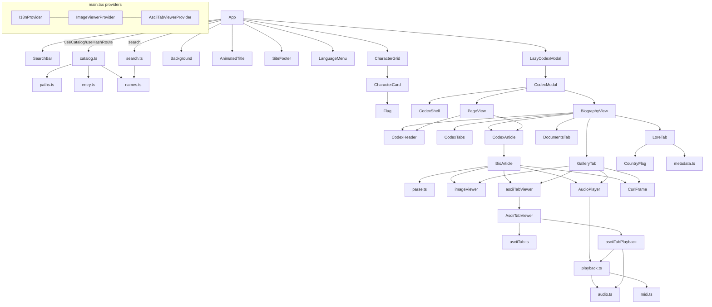

# 13 · `apps/guitar-codex/` — Code Map & Control/Data Flow (2026-07-21)

> Navigational companion to [`12-app-architecture.md`](12-app-architecture.md).
> "Where does X live and how does control reach it?" Pair with
> [`14-app-patterns-and-gotchas.md`](14-app-patterns-and-gotchas.md) (how to work
> here) and [`15-app-critique.md`](15-app-critique.md) (what's weak / backlog).
> All paths are repo-relative; line numbers drift — treat them as anchors.

> ✅ **Catalogue v2 migration — code complete (2026-07-31).** Steps 4, 5 and 6
> are in: `lib/entry.ts` + `lib/names.ts`, a validating/normalizing
> `catalog.ts` that assembles a `Catalog`, no `prefetchAll`/`rankings`, dotted
> hash slugs, a weighted-scoring `search.ts` with `useDeferredValue`, and the
> codex decomposed into Shell/Header/Tabs/Article + BiographyView/PageView.
> Only **Step 7** (`lint:content` + Vitest) is left — see
> [`the plan`](../docs/proposals/Plan_Catalog-v2-index-ids-localized-names-codex-split.md).
> Format spec: [`docs/Catalog-Index.md`](../docs/Catalog-Index.md).

## Layered architecture (bottom → top)

```
main.tsx  ─ providers: LazyMotion(strict) › I18nProvider › ImageViewerProvider › AsciiTabViewerProvider › PdfViewerProvider › App
App.tsx   ─ single orchestrator: catalog load, search criteria, facts crawl gate, hash route, audio toggles, body scroll-lock, codex mount
  ├─ Feature switches     config.ts  (FEATURES · GRID · EFFECTS · DOSSIER · HERALD — one place to turn a feature off/tune it)
  ├─ Data/content layer   catalog.ts · paths.ts · types.ts · metadata.ts · languages.ts · hooks.ts · dismiss.ts
  ├─ Remembered choices   settings.ts  (one localStorage document: lang · sound · ambient · effects · textScale · search)
  ├─ Search + i18n        search/{fold,docs,scoring,criteria,predicates,engine,cache,persist} · i18n.tsx · messages/* · languages.ts
  ├─ Dossier facts        dossier/{facts.ts, factsStore.ts, useFacts.ts}  (cross-entry *.bio.json metadata, read in the browser)
  ├─ Herald               herald/{types, today, anniversary, quotes, playlist, useHerald}
  ├─ BioMD render         biomd/{parse.ts, headings.ts, useBioDoc.ts, remarkHighlight.ts, remarkZeroPaddedLists.ts, BioArticle.tsx}
  ├─ Audio                audio.ts · playback.ts · midi.ts · asciiTabPlayback.ts · AudioPlayer.tsx
  ├─ Overlays (viewers)   imageViewer.tsx+ImageViewer.tsx · asciiTabViewer.tsx+AsciiTabViewer.tsx · asciiTab.ts
  │                       pdfViewer.tsx (the third one — any .pdf link, same shape)
  ├─ Document viewer      pdf/{PdfModal, PdfViewer, PdfToolbar, PdfPage, LazyPdfModal, LazyPdfViewer} · lib/pdf/engine.ts
  ├─ Browse UI            CharacterGrid · CharacterCard · AnimatedTitle · Background · SiteFooter · LanguageMenu
  │                       ShareMenu.tsx + lib/share.ts  (the footer's "VII · Share page" flyout)
  │                       search/{SearchBar, AdvancedSearchPanel, AdvancedToggle, DossierProgress}
  │                       herald/{HeraldBanner, HeraldFrame, HeraldMessageView, AnniversaryLine, QuoteLine, tones}
  ├─ Form atoms           form/{Field, TextField, SelectField, TokenSelect, SegmentedControl, Chip, ChipGroup, YearRangeField}
  ├─ Codex modal          codex/{CodexModal, CodexShell, CodexHeader, CodexTabs, CodexArticle,
  │                              BiographyView, PageView, CodexSkeleton, useCodexEntry, codexScroll}
  │                       codex/tabs/{Gallery, Documents, Lore}Tab
  └─ Shared UI atoms      OrnateFrame · Flag · CountryFlag · CurlFrame · placeholder.ts · index.css
```

**Philosophy (the through-line):** the app is a *pure renderer* — **all** content lives outside it in `../pages/` (mounted as Vite `publicDir`) and is fetched at runtime; nothing is bundled. It is a faithful, i18n-first re-creation of the legacy `guitar-times.ru`/`abc-guitars.com` site as an antique-manuscript "RPG codex," engineered for low-end devices (lazy chunks, idle prefetch, no canvas), with **deterministic per-entry identity** (theme/accent/placeholder all seeded from the slug) and **graceful degradation everywhere** (unknown blocks render, missing data → absent rows, failed fetch → soft-null, broken img → hidden/placeholder).

## File inventory by layer

### Entry & orchestration
| File | Role / key exports |
|---|---|
| `src/main.tsx` | Root render + provider nesting (see above). `LazyMotion features={domAnimation} strict` → only `m.*` allowed, no full `motion.*`. |
| `src/App.tsx` | The one orchestrator. Owns: the single `SearchCriteria` value (+ `useDeferredValue`) and its `compile()`, the `useFacts` gate, `useCatalog`, `useHashRoute`, `useAudioUnlock`, sound/ambient toggles, **body scroll-lock (single owner — do not move to the modal)**, facets (sorted by *label* with `Intl.Collator`), native/foreign result split + `nativeCount`, `turnPage` (← →), `openLinkedEntry(slug)` (cross-entry links, already classified by `BioArticle`), footer section links. Browse UI reads `catalog.listed`; routing reads `catalog.bySlug` (**all** records, so hidden pages stay reachable). Mounts `LazyCodexModal` under `Suspense`+`AnimatePresence`, **deliberately unkeyed** (see [14](14-app-patterns-and-gotchas.md)), and warms the two entries either side of the open one at idle so ← → resolves from memory. |
| `src/index.css` | **The running order, and nothing else** — the font imports, `@import "tailwindcss"`, and fifteen `@import "./styles/*.css"` lines. Since the sheet is unlayered, that list *is* the cascade; the file says so and names the two orderings that matter (`tokens` first, `chrome`'s `btn-rpg` above everything that narrows it). |
| `src/styles/*.css` | The stylesheet itself, split by concern (2 528 lines in one file → 47–318 each): `tokens` · `base` · `chrome` (parchment, gold frame, `btn-rpg`) · `topbar` · `home` (frontispiece, page band, catalogue grid) · `search` · `herald` · `footer` · `codex` · `article` · `figures` (incl. `.fx-curl`) · `blocks` (the BioMD `:::` constructs) · `viewers` (audio pill, ASCII tab) · `counter` (the visitor plate, its odometer, the chronicle panel) · `effects`. **Still unlayered → beats Tailwind utilities (footgun).** |
| `index.html` | Static shell, `lang="ru"`, inline "Кодекс открывается…" fallback, ❧ emoji-SVG favicon. No SSR. |

### Data / content layer
| File | Role |
|---|---|
| `src/lib/catalog.ts` | **The catalogue**, in two halves. *(2026-08-13: adds `peekEntry` — the synchronous read of an already-loaded edition, so a ← → turn to a visited entry paints in one frame — `prefetchEntry`, and an `ARTICLE_CACHE_LIMIT = 48` LRU over `bundleCache`/`bundleReady`/`textCache`. **2026-08-28: `jsonCache` is now LRU too (`DOSSIER_CACHE_LIMIT = 120`)** — it was unbounded because the facts crawl reads every dossier; the crawl keeps the four fields it wants rather than the dossiers, so the cap costs it nothing and only bounds a session-long map.)* *Read model:* `CatalogRecord {entry,id,slug,langs,listed,biography,pdf?,display}`, `Catalog {records,listed,bySlug,names}`, pure `buildCatalog(entries,names)`, `EMPTY_CATALOG`. *I/O + cache:* `loadIndex()` (validates & **normalizes case once at the boundary**; drops rows with no `id`, or with neither `md` nor `pdf`; duplicate id/slug → DEV warn, first wins; rejection is not cached so retry works), `loadNames(lang)` (per-lang, missing file → `{}`, never throws), `loadEntryData(entry,lang)` (**dossier only, no article** — what the facts crawl uses) and `loadEntry(entry,lang)` (per-`slug::lang`, dossier + article; **skips the JSON fetch when `json` is absent** — a page makes no speculative request). Four module-level **promise** caches. |
| `src/lib/entry.ts` | Pure per-entry facts: `slugOf` (basename of `md`, or of `pdf` when there is no `md`), `isBiography` (`json` declared), `isDocumentEntry` (`pdf` declared, no `md`), `isListed` (`type !== "hidden"`), `portraitPath` (img → `photos/default-<gender>.svg`), `initialsFrom` (code-point safe), `entryTargetSlug` (**the one** in-app link classifier: `#/slug`, `/#/slug`, `x.bio.md`, `x.md`), `SLUG_PATTERN` (now `[\w.()-]+` — brackets so archive scan names survive), `decodeSlug`. **All visibility/biography/document branching goes through these predicates.** |
| `src/lib/names.ts` | `displayName(names,id,fallback)` / `aliasesOf(names,id)` over an `index-<lang>.json`. `[0]` renders, `[1…]` are search-only. |
| `src/lib/paths.ts` | **Three bases**: `APP_BASE`(`import.meta.env.BASE_URL`) for index.json + its json/md/img via `resolveContentPath`; `RESOURCE_BASE_PATH`(`VITE_RESOURCE_BASE_PATH ?? "/pages"`) for in-entry media/docs via `resolveResourcePath`; and the **site root** for index.json's `pdf` via `resolveSitePath` (leading slash and nothing else — the document archive is beside the app, not inside it, so it survives `--base=/fable/`). The latter is one pipeline: strip `?#` suffix → detect `^` anchor → `basePrefix` (skip base if anchored or already spelled out) → `collapse` `.`/`..` clamped at the root → rejoin. `localizeContentPath` (json/md only), `isExternalUrl`, and `isCrossOrigin` — *not* the same question: legacy content spells its own links out in full, and those are same-origin on the deployed site. It matters wherever the app wants to **read** a file rather than hand it to the browser (`lib/pdfViewer`). (`slugOf` moved to `entry.ts` — it is about entries, not paths.) |
| `src/lib/types.ts` | `IndexEntry` (v2 row: `id`/`title`/`type`/`md` required, `lang`/`gender`/`country`/`json`/`img` optional; `country` UPPERCASE, other enums lowercase after normalization), `Gender`, `NameIndex`, `EntryMeta` (dossier — **no** id/title/gender/type/country/bio), `EntryData`, `EntryBundle`, `MediaItem`, `DocumentItem`. |
| `src/lib/metadata.ts` | DMY dates (`parseDmy`/`formatDmy`/`yearOf`/`ageOf` — **never `new Date(str)`**), `splitList`, `countryName(iso,locale)` (case-insensitive; one cached `Intl.DisplayNames` per locale), `rankStars`, `fnv1a`, `accentFor`. |
| `src/lib/languages.ts` | `LANGUAGES` (curated order, `ru` 8th), `Lang`, `DEFAULT_LANG="ru"`, `entryLangs`/`parseLangList`/`pickContentLang`, `langInfo`. |
| `src/lib/hooks.ts` | `useAudioUnlock` (gesture unlock), `useCatalog(lang)` → `{state,retry}` resolving `[loadIndex, loadNames]` into one `Catalog` (**keeps the loaded catalogue on screen across a language switch** — no skeleton flash), `useHashRoute` (`#/slug`; `SLUG_PATTERN` allows dots + `decodeURIComponent`). |
| `src/lib/dismiss.ts` | `useDismissOnOutside(open, onDismiss)` → the ref for the element owning **both** trigger and panel. Escape is **capture-phase + `stopPropagation`** so the innermost layer closes first. Shared by `LanguageMenu` and the search panel — the one light-dismiss implementation. |
| `src/config.ts` | `FEATURES` (`advancedSearch`, `herald`) · `DOSSIER` (`warmOnIdle`, `concurrency`, `notifyThrottleMs`) · `HERALD` (`revealDelayMs` range, `rotateMs`, `anniversaries`, `quotes`) · `COUNTER` (`enabled`, `endpoint`, `display`, `digits`, `record`, `timeoutMs`). Typed as plain `boolean`/`number` on purpose, so flipping a flag never narrows into dead code. |

### Dossier facts index (cross-entry `*.bio.json` metadata)
| File | Role |
|---|---|
| `src/lib/dossier/facts.ts` | `EntryFacts` — the searchable slice of one dossier edition (`forenameKey`/`surnameKey` **folded at build time**, `born`/`died` as `Dmy`, plus slug/display/gender from the index row). Pure `factsFrom(record, data)`; `emptyFacts`; `NO_FACTS` (the stable empty map). |
| `src/lib/dossier/factsStore.ts` | `FactsIndex` — the **one** crawl of every listed entry's dossier, at module scope so it outlives any component and happens at most once per (catalogue, language). `start()` idempotent; `DOSSIER.concurrency` workers draining a shared cursor; `whenIdle()` between entries (`requestIdleCallback`, `timeout: 400`); `commit()` publishes a **fresh Map** per notification (so `useMemo` deps behave) and throttles intermediate ones (`done` always lands at once). `factsIndexFor(records, lang)` registry keyed by lang, stale index `dispose()`d. Reads via `loadEntryData` ⇒ **never fetches article text** and shares the codex's per-path cache. |
| `src/lib/dossier/useFacts.ts` | `useFacts(records, lang, enabled)` over `useSyncExternalStore`. `enabled` false ⇒ the empty snapshot and **zero requests**; callers need no null handling. |
| `src/lib/glyph.ts` + `src/components/Glyph.tsx` | **Measured Unicode signs (2026-08-30).** `fitGlyph(char, font, ref)` returns four unitless ratios — `scale`, `aspect`, `dx`/`dy`, `cx` — from a DOM baseline probe (where the baseline sits in a `line-height: 1` box) plus one canvas `measureText` (where the ink is). `<Glyph>` renders a stated-size layout box with the text absolutely positioned inside it, so **no symbol face can change the size of the control around it**. `sizedBy` scales a related set by one reference glyph rather than stretching each member to a common height. Signs themselves live in `src/lib/signs.ts` with U+FE0E on every emoji codepoint. **Read [`16-cross-platform-glyphs.md`](16-cross-platform-glyphs.md) before touching a symbol anywhere in the chrome.** |

### Visitor counter (the odometer in the bar, and the chronicle behind it)

*Added 2026-08-31. The app's **only** server dependency: `server/counter.php`
(one file, no database — see `server/README.md`). Two requests per reader, no
polling: one on load, one more if they open the panel.*

| File | Responsibility |
|---|---|
| `src/lib/counter/types.ts` | `Pulse` (the compact document: three lifetime figures + `today` + `online` + `since`) and `Stats extends Pulse` (history, hour histogram, weekday histogram, top pages/tongues/referrers, device/browser/system, peaks, streak, averages, bots). `OTHER_KEY = "*"` — the server's "did not fit in the top N" bucket. Dates here are **ISO `YYYY-MM-DD`**, not the catalogue's DMY. |
| `src/lib/counter/api.ts` | The whole conversation: `recordVisit(lang, slug)` (`?a=hit` or `?a=pulse`, decided by `COUNTER.record`) and `loadStats(lang)` (`?a=stats`). Endpoint resolved with **`resolveSitePath`** — the counter sits beside the app, like `pdf`. `AbortController` + `COUNTER.timeoutMs`; `credentials: "omit"`; every number coerced on the way in (`num`/`str`/`tally`/`slices`), because one `undefined` reaching the odometer draws `NaN` on six drums. `referrerHost()` sends the **host only** of `document.referrer`. |
| `src/lib/counter/store.ts` | Module store (`useSyncExternalStore`), for two reasons: the plate and the panel are not parent and child (the panel cannot live inside the `backdrop-filter`ed header), and the visit must be recorded **once per page load** — a module flag guarantees that where an effect does not (StrictMode). `primeCounter(lang)` is idle-scheduled; `adoptPulse` also writes `preferences().counter`; `rememberStats`/`freshStats` hold one statistics document for `STATS_TTL_MS` (20 s, matching the endpoint's own cache) so reopening the panel is instant and costs no request. |
| `src/lib/counter/format.ts` | Display shaping, with two rules: **no `new Date(string)`** (an ISO day parsed as UTC midnight formats a day early west of Greenwich), and `Intl` formatters **cached per locale** (the panel formats ~110 values per open; constructing a formatter each time was the one real cost in it). Plus `fillMissingDays` — the server's history is sparse, so a one-day-old counter would otherwise draw a single bar the width of the chart. |
| `src/components/counter/Odometer.tsx` | The drums. Eleven cells per drum (0–9 + a spare 0) and `--cell` driving one `translateY`; turning **over** (9→0, or any decrease) rolls forward onto the spare zero, then jumps back with the transition off for one *painted* frame — hence the double `requestAnimationFrame`. `ROLL_MS` must equal `--counter-roll`. |
| `src/components/counter/VisitorCounter.tsx` | The plate in the bar: ✦ + odometer + wordmark, one button. Opens on the remembered tally and turns to the live one. Motion follows the reader's **fx switch** (`useFx`), not `prefers-reduced-motion` — the hint only picks that switch's default. Preloads the panel on pointer/focus. A failed endpoint dims the drums and says so in the tooltip; it is never an error the reader must deal with. |
| `src/components/counter/StatsModal.tsx` | The chronicle: shell (scrim, focus, capture-phase Escape, own body-scroll lock, its own fetch) + `StatsSheet` (the reading of numbers). Nine sections; the "most-read entries" rows are buttons **only** when `App`'s `resolveTitle` finds the slug in `catalog.bySlug` — an unknown slug stays plain text. Opening an entry closes the panel. |
| `src/components/counter/StatParts.tsx` | Four presentational atoms: `SectionCard` (`wide` = a whole grid row), `StatTile`, `Meter`, `BarChart` (CSS boxes, not SVG). |
| `src/components/counter/LazyStatsModal.ts` | The lazy + preload singleton. The panel is its own chunk (~8.8 KB, 3 KB gzipped) and never in the main bundle. |

### Herald (the dynamic line under the title)
| File | Role |
|---|---|
| `src/lib/herald/types.ts` | Closed union `HeraldMessage` = `default | anniversary | quote`, each carrying its own `tone`; `DEFAULT_MESSAGE`; `messageKey` (animation key — messages are rebuilt on every language switch, so identity is not a key). |
| `src/lib/herald/today.ts` | `todayDmy()` — a `Dmy`, never a `Date`, because everything it is compared against is `DD.MM.YYYY`. **DEV-only** `?herald-date=DD.MM.YYYY` pins the day for QA. |
| `src/lib/herald/anniversary.ts` | Pure `findAnniversaries(facts, today, seed)` — day+month match, `years ≥ 1`, **births take precedence over deaths** (if anyone was born today the deaths are not mentioned). Order is a **per-visit shuffle**, not a ranking: the block names one person every `rotateMs`, so a fixed order (it used to be oldest-first) means the 4th and 5th of five sharing a day are never read. The key is `fnv1a(slug)` avalanched against the caller's seed — concatenating the seed onto the slug does *not* shuffle (FNV mixes forward). Seeded rather than drawn, so re-runs as facts stream in do not reorder what is on screen. |
| `src/lib/herald/quotes.ts` | `loadQuotes(lang)` → `pages/quotes/quote-<lang>.json`, cached per language, fails soft, **no cross-language fallback** by design. |
| `src/lib/herald/playlist.ts` | `buildPlaylist(anniversaries, quotes, quoteOffset)` — alternates the two pools (the shorter repeats), or cycles the one that is filled; empty when there is nothing to say. `quoteOffset` is chosen by the caller, so this stays pure. |
| `src/lib/herald/useHerald.ts` | Scheduling only. `index: number | null` (null = the default line); reveal uses an **absolute deadline** so streaming dossiers cannot keep postponing it; the rotation effect depends on `playlist.length`, not the array, so a rebuilt-but-same-length playlist does not restart the clock; **no timer at all** when there is ≤ 1 thing to say. |

### BioMD parser / renderer
| File | Role |
|---|---|
| `src/lib/biomd/parse.ts` | Recursive-descent `::: block` fence parser over line-segmented text → `BioDoc {titles,nodes,warnings}` (spec v1.6). `titles` = the document's `# ` line(s), **at most two** (spec §2 wants one; a migrated name is often split over two), lifted out of the body *wherever they sit* — commonly inside an `::: align` — with the emptied wrapper pruned and code/verse fences skipped. A third `#` stays body text. **The whole grammar is one table, `BLOCKS`**: per directive — documented `props`, `leaf?`, `rejects?` (child kinds refused, spec §4.1) and `build(ctx)`; adding a directive = adding one entry. Node kinds: `markdown·lead·align·image·images·document·columns·nav·frame·signature·anchor·unknown`. Tolerant by construction: unknown block/property, stray child, unclosed fence and **misplaced** directive all keep their readable content (`readableContent` unwraps it) + warn — only a `key: value` line whose key the block *declares* is eaten as a property, so prose can never be swallowed. The one-line `:: anchor{#name}` is desugared by `segment()` into an ordinary `anchor` block, so the table stays the only grammar; and because an anchor has no box, `columns` binds a stray one to the next cell and `images` to the next picture (`ImageNode.anchor`) rather than letting it claim a grid track. |
| `src/lib/biomd/headings.ts` | Who names an open entry — `planHeadings(docTitles, {title,secondary}, fallback)` → `{title, secondary?, articleTitles}`, and the `nameSimilarity`/`isSameName` behind it: word overlap against the **shorter** side (so "Агустин Барриос" ⊃-matches "Агустин Барриос Мангоре"), words folded, one-letter spelling drift forgiven ("Френсис"/"Франсис"). Threshold `SAME_NAME = 0.95`. |
| `src/lib/biomd/useBioDoc.ts` | `useBioDoc(md)` — the one parse per edition, lifted out of the renderer because the plate needs the titles above the article. |
| `src/lib/biomd/anchors.ts` | The `::: anchor` ↔ `[…](#name)` id contract (spec §19): `anchorName` (canonical name), `anchorElementId` (the `bio-anchor-` namespace, so an id taken from content cannot collide with one the app owns), `anchorLinkTarget` (`#name` yes, `#/slug` no — that one is `entryTargetSlug`'s), and `scrollToAnchor(name, from)` — resolved inside `from`'s own `.bio-article`, `prefers-reduced-motion`-aware, and **never touching the hash**. |
| `src/lib/biomd/remarkHighlight.ts` | remark plugin: `==text==` → `<mark>` via mdast `data.hName`. Can't span lines / contain `=`. |
| `src/lib/biomd/remarkVerse.ts` | remark plugin (spec 3.9): a fence with **no** info string is verse, not code → a `.bio-verse` div of `<p>` stanzas with `<br>` lineation, so it wraps inside the reading column instead of scrolling sideways; an empty fence is dropped; a fence *with* a language stays a `<pre>`. Runs last in the plugin list, so fenced text stays literal. |
| `src/lib/biomd/remarkZeroPaddedLists.ts` | remark plugin (spec 3.4): an ordered list whose *source* marker is `01.` gets `class="bio-ol-zero"` → CSS `decimal-leading-zero`. remark normalises `01`→1, so the padding is read back from the first item's source offset. |
| `src/lib/biomd/BioArticle.tsx` | Takes an **already parsed** `doc` (the view above it reads its titles first — see `useBioDoc.ts`) plus `titles`, the `# ` line(s) the codex plate is *not* showing, printed as `.bio-title`. react-markdown (GFM + highlight) renderer + **link-rewiring hub** — in-app entry (`entryTargetSlug`: `#/slug`, `x.bio.md`, `x.md`) → `onNavigateEntry(slug)`, `#name`→a `.bio-jump` **button** (never an `<a>`: the hash is the router) that scrolls to that anchor, audio→player, .txt→tab viewer, image→zoom viewer, external→new tab, else archival. Renders `Figure`/`images`/`DocumentCard`/`BioNav`. Wraps images in `CurlFrame` (optional `frame` variant). `Md`'s optional `nav` prop = nav mode: suppresses media widgets, renders the `active` label — or a plain-text item (spec 1.5) — as `aria-current`. Also renders `frame`/`signature`/`columns` (`.bio-columns` + `bio-cols-N` + `--divided`, grid owned by CSS — no grid utilities on it) and `mode: embed` (lazy PDF `<iframe>` + the link card as fallback). |

### Search & i18n
| File | Role |
|---|---|
| `src/lib/search/` | Ranked client-side search, split **by what each step depends on**. `fold.ts` — `fold` (Latin-only diacritic strip, `ё→е`), `translitVariants` (capped 64), `isAscii`, `CYRILLIC`. Also used by `dossier/facts.ts`, so there is one folding rule in the app. `docs.ts` — **corpus-side, once per catalogue + UI language:** `buildSearchIndex(records, names)` → `SearchDoc{record, fields}`; each `Field{text (folded), weight 3 name / 2 alias / 1 latin-title-or-slug, latin}`, deduped keeping the highest weight. `scoring.ts` — **query-side, once per query:** `tokenize` (fold + translit only for Cyrillic tokens); **per doc** `matchScore` — one `indexOf` yields exact 100 / prefix 70 / word-start 50 / contains 25; transliterations score 10 and only against `latin` fields; token score = best field hit × weight, **AND across tokens**, summed. Measured **0.398 ms/query at 1249 docs** — why there is no inverted index. |
| `src/lib/search/criteria.ts` | `SearchCriteria` = the whole form in one value (`query`, `types`, `countries`, `gender`, `scope`, `forename`, `surname`, `born`/`died` year ranges as **typed strings**) and `compile()` → `CompiledCriteria` (folded terms, parsed bounds, "unset" collapsed to `null`, `needsDossier`). `compile` is the one boundary between them, so **a new criterion is three edits: the interface, `compile`, one predicate**. Also `EMPTY_CRITERIA`, `toggleValue`, `refinementCount` (counts *fields*, not values), `withoutRefinements` (keeps the query). Reversed year ranges are read the way they were meant. |
| `src/lib/search/predicates.ts` · `engine.ts` | `matchesIndex` (index.json only — free) vs `matchesDossier` (needs that entry's `*.bio.json`). `runSearch` runs index filters → dossier filters (**only when `needsDossier`**) → relevance, cheapest first, and returns **both orders**: `matched` in catalogue order (what the cache narrows against) and `ranked` for the reader. `searchEntries` is `runSearch(…).ranked`. **An unread dossier excludes**, so a result list is never wider than the evidence. |
| `src/lib/search/cache.ts` | **Search-as-you-type, narrowed (2026-08-28).** `searchIncremental` re-ranks the *previous* result set when every filter is unchanged and the folded query extends the previous one (`CompiledCriteria.text`). Sound because `fold` is order-preserving, a field containing a token contains its prefixes, and `translitVariants` expands left-to-right — so growing a query can only lose documents. Filters drop to the full corpus (removing a facet *widens*, and set identity does not say which way). DEV: `__search.stats` — measured **94 % of passes narrowed, 206 docs scanned on average, 0.075 ms**. |
| `src/lib/search/persist.ts` | `capture`/`restore` between `SearchCriteria` (with `Set`s) and the plain-JSON `StoredSearch`; **the free-text query is deliberately not remembered**. `defaultsFor(lang, available)` is the first-visit filter — the reader's language's country, derived from `languages.ts`'s Intl locale via `countryOfLanguage` rather than a second table, and **refused when it would empty the grid**. |
| `src/lib/i18n.tsx` | `I18nProvider`/`useI18n`/`t`. `detectLang` (**`settings.ts` → navigator → `ru`** — it no longer touches `localStorage` itself), `Intl.PluralRules`, `{k}` interpolation, fallback `lang→en→ru→key`. |
| `src/lib/settings.ts` | **The one remembered document (2026-08-28).** `preferences()` / `setPreference(k,v)` / `usePreference(k)` over one versioned `codex-settings` key, replacing the scattered `localStorage` calls in `i18n.tsx` (`codex-lang`) and `fx/store.ts` (`codex-fx`), which it still migrates from. Holds `lang · sound · ambient · effects · textScale · search` (`textScale` since 2026-09-01: the codex's reading-size ratio, bounds and steps owned by `CodexShell`, not by this module). **`null` means "not chosen", never "off"** — that is what lets a default apply without ever overriding a choice. Writes coalesce (400 ms) and flush on `pagehide`/`visibilitychange`, so persisting the filter as it is typed is free. DEV: `__settings`. |
| `src/lib/messages/ru.ts` | **Source of truth**: `satisfies Record<string,Message>` + `export type MsgKey = keyof typeof ru`. |
| `src/lib/messages/{en,es,ja,de,fr,it,pt,zh,ko}.ts` | Typed `Record<MsgKey,Message>` → missing/extra keys = compile error. |
| `src/lib/messages/{types,index}.ts` | `Message`/`Plural` types; `DICTS` map (adding a `Lang` w/o dict = compile error). |

### Audio (all runtime-synthesised; only user mp3/wav/midi are files)
| File | Role |
|---|---|
| `src/lib/audio.ts` | Singleton `audio` (`AudioEngine`): one-shot SFX, ambient bed (I–V–vi–IV loop), per-entry deterministic **theme** (`themeFromSeed`). Own `AudioContext` + master→limiter→destination + convolver "room". |
| `src/lib/playback.ts` | `useAudioPlayback(src,kind)` over `NativeBackend`(HTMLAudio) / `MidiBackend`. **Format table `AUDIO_MIME`** maps ~25 extensions to the MIME spellings worth probing (several per format — engines disagree between `audio/mp4` and `audio/x-m4a`). `audioKind()` returns `"native"` **only when `canPlayType` says the browser has a decoder** (cached per extension); `isAudioUrl()`/`isUnplayableAudioUrl()` separate "not audio" from "audio this browser can't decode" (WMA, RealAudio, AIFF-in-Chrome) so the UI can offer a download card instead of a play button that only errors. **Single-active coordinator** (`claimPlayback`/`stopAllPlayback`, module-level `stopActive`) — keys on stop-callback reference identity. |
| `src/lib/midi.ts` | `loadMidi` (lazy `@tonejs/midi`, per-URL cache, soft-null) + `MidiPlayer` (own context, look-ahead scheduler). |
| `src/lib/asciiTabPlayback.ts` | `useAsciiTabPlayback` — oscillator preview from tab data (own context; approximate). |
| `src/components/AudioPlayer.tsx` | Presentational `AudioPlayer`/`InlineAudioPlayer` over `useAudioPlayback`. |

### Overlays / viewers (twin provider pattern)
| File | Role |
|---|---|
| `src/lib/imageViewer.tsx` | `ImageViewerProvider`/`useImageViewer`/`isImageUrl`. Holds one `ViewerImage|null`, mounts `LazyImageViewer key={src}`. |
| `src/lib/pdfViewer.tsx` | **The third overlay of the same shape (2026-09-01).** `PdfViewerProvider`/`usePdfViewer`/`isPdfUrl`/`isViewablePdf`, mounting `LazyPdfModal key={src}` at `z 60` — over an open codex, beside the image and tablature viewers. It exists because a PDF was the one archive file the app could render and still gave away: a `.pdf` reached from an article link, a `::: document` block or a `documents[]` row opened in a browser tab (on a phone, usually a download) while an index row that *is* a PDF opened in the themed viewer. `isViewablePdf` = ends `.pdf` **and** `!isCrossOrigin` — pdf.js fetches the file itself, so somebody else's server has to opt in, and a viewer that reliably says "could not be opened" is worse than the tab it replaced. |
| `src/components/ImageViewer.tsx` | Full-screen zoom/pan/rotate/1:1/download viewer. |
| `src/lib/asciiTabViewer.tsx` | `AsciiTabViewerProvider`/`useAsciiTabViewer` — same shape as image viewer. |
| `src/lib/asciiTab.ts` | Tab detection (`isAsciiTabUrl` = `.txt`), tolerant decode/parse → immutable `TabDocument` (grid-authoritative, unbounded `documentCache`). **Decode order:** BOM → BOM-less UTF-16 (NUL parity, checked before the `^Z`/NUL trim) → transport charset → strict UTF-8 → scored legacy code pages; never U+FFFD, and an inferred answer sets `encodingInferred` + an `assumed-encoding` diagnostic. **Row detection:** `LABELED_BAR_PREFIX` (`E-|`,`E||`,`e:`,`E*`) / `LABELED_STAFF_PREFIX` (`E ---`,`E 3--`) / `UNLABELED_PREFIX` (`||`,`|*`,`*|`,`|`) / bare continuation, the last two gated on `staffRatio ≥ MIN_STAFF_RATIO`. `TOKEN_RE` folds a technique marker into the fret token and `splitFretRun` splits packed digit runs. |
| `src/components/AsciiTabViewer.tsx` | SVG "score" + raw fallback + zoom + approximate playback. |

### Document viewer (`pdf/`) — added 2026-08-30
An index row with `pdf` and no `md` **is** a PDF (`docs/Catalog-Index.md` §9.1);
App mounts `LazyPdfModal` for it instead of `LazyCodexModal`, under the same
`Suspense`/`AnimatePresence`/`ErrorBoundary`. Constant keys `"pdf"`/`"codex"`
let AnimatePresence tell the two apart when ← → crosses between them.

| File | Role |
|---|---|
| `src/lib/pdf/engine.ts` | The only module that imports `pdfjs-dist`. Sets `GlobalWorkerOptions.workerSrc` from a `?url` import of `pdf.worker.min.mjs` (Vite emits it as a hashed asset; pdf.js builds `new Worker(src, {type:"module"})` itself), points cMap/standard-font/ICC/wasm URLs at `<BASE_URL>pdfjs/`, and exports `loadPdfDocument(url)` + `isCancellation(err)`. |
| `src/components/pdf/PdfModal.tsx` | CodexShell's **sibling**, not its client: same backdrop, page-turn, corner filigree and one `CLOSE_MS` clock — but no tabs, header, dossier, language menu or ←/→ leafing. Addressed by **file**, not by entry — `{title, src, download?, z=40}` — because the same room opens for an index row that is a document (App resolves `record.pdf` with `resolveSitePath`) and for a `.pdf` met inside an entry (`lib/pdfViewer` resolves against the *resource* base and passes `z=60`). Escape is capture-phase + `stopPropagation`, so shutting a document opened from an article does not also shut the codex behind it. |
| `src/components/pdf/PdfViewer.tsx` | The reader. Every page gets a *box* from the start (real scrollbar, one-scroll paging); only pages inside a ±1200 px render window get *pixels*. Page size is estimated from page 1 and corrected per page as each opens. `fit` is a **mode** (`"width"`/`"page"`/null) re-satisfied on resize/rotation, not a frozen number. Two IntersectionObservers over the same elements: a wide one for the render window, a thin mid-pane band for "which page am I on". `useDeferredValue(scale)` splits display scale from render scale. A layout effect re-anchors the current page after any zoom/rotate/resize. |
| `src/components/pdf/PdfPage.tsx` | One page: canvas + pdf.js `TextLayer` (selection; skipped while rotated, because pdf.js lays the layer out in unrotated page space). Canvas is CSS-sized by the wrapper and pixel-sized by `renderScale`, so a zoom stretches the old bitmap instead of blanking. A **re-render** paints into a detached canvas and blits on completion (pdf.js clears whatever it draws into); the first paint goes direct. `MAX_CANVAS_PIXELS` gives up DPR before the browser's ~16 Mpx limit. |
| `src/components/pdf/PdfToolbar.tsx` | Presentational: close · title · ‹ page › · − % + · fit-width / fit-page / rotate / download. One flat wrapping row; `sm:mr-auto`/`lg:mr-auto` restore the left/right split once there is room. The page field follows the scroll except while being typed in. |
| `src/components/pdf/{LazyPdfModal,LazyPdfViewer}.ts` | The chunk boundary. `index.ts` deliberately re-exports **only** these — exporting `PdfViewer` from the barrel would drag pdf.js back into the importing chunk. |
| `vite/pdfjs-assets.ts` | Serves/copies pdf.js's runtime **data** (`cmaps`, `standard_fonts`, `iccs`, `wasm`) at `<base>pdfjs/` — from `node_modules` in dev, copied into `dist/` on build. Not in `publicDir`, because that is the content tree. |

**Budget:** `pdf` chunk ≈ 415 KB (123 KB gzip) + a 1.2 MB worker asset + ~3.7 MB of lazily-fetched runtime data. None of it is in the main bundle; a session that never opens a PDF never sees any of it.

### Browse UI & shared atoms
| File | Role |
|---|---|
| `src/components/CharacterGrid.tsx` | **Paged grid (2026-08-28).** `GRID.pageSize` cards, `GRID.autoPages` free reveals on an `IntersectionObserver` sentinel, then an explicit "show more". Adjusts `shown` **during render** when `records` identity changes, so a new result list never paints one frame of the old page count. `AnimatePresence`/`layout` are gone — they cost 15.7 s on a keystroke at 736 entries; cells keep a one-shot mount fade. Ornate divider and dimmed foreign cards unchanged. |
| `src/components/search/CountryFilter.tsx` | The country facet as a row of flags, ordered by entry count, compact to 18 with a `+N` expander; selection reads by *dimming the others*. Names survive as `title`/`aria-label`. |
| `src/components/CharacterCard.tsx` | Pointer-tilt 3D card (own effect — **not** `.fx-curl`), glare/shine, rank stars, foreign flag chips, preloads codex on intent. |
| `src/components/search/SearchBar.tsx` | The turning clef (`ClefSpinner`, was a loupe SVG) + name box, the quick facet chips, and the handle to the refinement panel. Owns **one** piece of state (is the panel open); every criterion lives in `App`, so the chips and the panel are two views of one value. `aria-live` count. **No debounce** — `useDeferredValue` in `App` does that job. |
| `.../search/AdvancedSearchPanel.tsx` | The refinement leaf: language scope · gender · craft · country · given/family name · birth & death year ranges. **Controlled and stateless** — every control reports a `Partial<SearchCriteria>` patch. Reading order = coarsest sieve to finest = the order the engine applies them. |
| `.../search/AdvancedToggle.tsx` · `DossierProgress.tsx` | Disclosure button (`aria-expanded`/`aria-controls`) with the refinement-count badge — with the panel shut, the badge is the only sign something other than the name is narrowing results. `DossierProgress` says *why* the list is still settling instead of blocking the page. |
| `src/components/form/*` | Codex-themed atoms: `Field` (label + control + hint), `TextField`, `SelectField` (native `<select>`, only the closed control restyled), `TokenSelect` (chosen values as removable tokens + a picker of the rest — the shape that survives 100 countries), `SegmentedControl` (radiogroup), `Chip`/`ChipGroup`, `YearRangeField`. |
| `src/components/herald/*` | `HeraldBanner` (the `useHerald` + `AnimatePresence mode="wait"` crossfade), `HeraldFrame` (tone-tinted plaque + `CornerOrnament`s), `HeraldMessageView` (the union's only exhaustive switch), `AnniversaryLine` (gender picks the **whole sentence**; `{name}` is spliced in as a node so the line can lead into the codex), `QuoteLine`, `tones.ts` (the static tone table: frame class, accent, glyph pair, label key, text classes). |
| `src/components/AnimatedTitle.tsx` · `Background.tsx` · `SiteFooter.tsx` | Title letter-reveal (`useReducedMotion`); static memoized backdrop; colophon whose nine sections are one table — most name a `slug`, `VI` the reserved guestbook route, `VII` `panel: "share"` (was "Search", which the live search bar made pointless), `VIII` `href: mailto:` from `SITE.email`; anything with no target left is still a placeholder. |
| `src/components/ShareMenu.tsx` + `src/lib/share.ts` | **The share flyout (2026-09-01).** `share.ts` is the registry the legacy `share42` block should have been: `SHARE_SERVICES` (VK · Telegram · WhatsApp · X · Facebook · OK) each building its URL through one `buildUrl` (`URL` + `URLSearchParams`, raw Unicode in, encoded once — never pre-encoded strings in a dictionary), plus `openSharePopup` (centred, `noopener,noreferrer`), `nativeShare` (Web Share API, `AbortError` counts as handled) and `copyLink` (clipboard → `execCommand` fallback). Dead services are absent, not commented out (Google+ 2019, memori.ru unverifiable); Mail.ru and LiveJournal are left out as "legacy — verify first". Spec: [`docs/social-share-i18n.md`](../docs/social-share-i18n.md). `ShareMenu.tsx` draws it: monoline emblems, **not** brand logos, and it unfolds **under the whole section grid** rather than out of the tile — a popover anchored to "VII" hangs off a 320 px screen, and the footer's own width has no edges to collide with. |
| `src/lib/fx/tier.ts` · `store.ts` | **Budgeted ornaments (2026-08-13).** `tier.ts`: async probe of **hardware only** → `PerfTier` (`low`/`mid`/`high`), measured once per tab and cached in `sessionStorage`. Static hints first (Save-Data / cores / `deviceMemory`) so a grade exists before first paint; then an arithmetic probe with a **fixed time budget and variable work** (never blocks a slow device longer than a fast one) and a median-rAF paint probe (timeout-guarded — a tab that never composites must not hang it). `store.ts`: module store + `useSyncExternalStore` over three separate axes — machine grade × reader switch (localStorage `codex-fx`) × `prefers-reduced-motion` (which only picks the switch's *default*) → `{tier, on, spin, glyphs}`. A grade scales `DENSITY`, never zeroes an effect. `window.__fx.state` in DEV answers "why is nothing moving". |
| `src/components/fx/ClefSpinner.tsx` · `MusicalDrift.tsx` | The two ornaments. `ClefSpinner` = the 𝄞 that replaced the search loupe, turning 360° about its vertical axis under `perspective(600px)`; the glyph is **always drawn** (it is the icon), only the turn is budgeted. It is a *font* glyph, so **nothing about its size is hard-coded**: one `measureText` on a detached canvas yields `--fx-clef-size` (the font-size at which this font's ink is `TARGET_INK_REM` tall), `--fx-clef-ink` (vertical lift) and `--fx-clef-nudge` (horizontal), measured once and cached. `MusicalDrift` = musical glyphs rising behind the page: N absolutely-positioned spans, **zero JS per frame**, `transform`+`opacity` only, inside a `contain`ed `pointer-events:none` layer; count follows the budget × viewport, `paused` stops the clock while a codex covers it. |
| `src/components/LanguageMenu.tsx` | Dropdown (variants `header`/`codex`); capture-phase Escape so it closes before the codex. |
| `src/components/OrnateFrame.tsx` | `CornerOrnament`, `Divider`, `RankStars` SVG atoms. |
| `src/components/Flag.tsx` · `CountryFlag.tsx` | Flags by **UI language** (10) vs by **ISO country** (~25 + `hasCountryFlag`) — two separate hand-drawn SVG sets (see [15](15-app-critique.md)). |
| `src/components/CurlFrame.tsx` · `lib/placeholder.ts` | Lifted-Curl image frame (`.fx-curl`); deterministic SVG portrait placeholder. |

### Codex modal
| File | Role |
|---|---|
| `src/components/codex/CodexModal.tsx` | **45 lines**: picks the view from `record.biography` and wires the shell. Nothing else. |
| `.../CodexShell.tsx` | All the chrome — backdrop, 3D page-turn panel, corner filigree, close/prev/next, the two reading-size steps, per-entry `contentLang` menu, the reading pane, the closing line, Esc/← →. **Reading size (2026-09-01):** `-`/`+` step a remembered ratio (`settings.textScale`, 0.8–1.6 by 0.1, disabled at the ends, no indicator — the page is the indicator) which is spent as `zoom` on `.codex-read`, so prose, plates, figures and the dossier grid grow together and a block inside still fills its parent rather than overflowing it. The **edition menu is the one control the row may drop**: `.codex-ctrl-lang` is hidden below 25 rem, where six controls fit a 320 px panel with ~2 px to spare. Margins are the row's own padding, never a child's, so removing it cannot move the corners. Knows nothing of dossiers or tabs. Pane is `absolute inset-[11px]` (keeps the scrollbar inside the border — invariant); resets scroll on `[slug, contentLang]`. **One shell survives every ← → turn**; closing runs the panel turn and the backdrop fade together on one `CLOSE_MS` clock (0 under reduced motion), and its `keydown` listener is bound once via a handler ref so App rebuilding `onTurn` per keystroke does not rebind it. |
| `.../codexScroll.ts` | One-value context so `CodexTabs` (two levels down) can reset the shell's pane without a threaded ref. |
| `.../CodexHeader.tsx` | `{kicker?, title, secondary?, subtitleParts}` → kicker · h1 (+ optional h2) · subtitle · ❦. **Both modes use it — the difference is data, not a branch.** Derives the long-title (roster) type scale itself. |
| `.../CodexTabs.tsx` | The tab strip + `CodexTab` type. Switching plays the page-turn and scrolls the pane to the top. |
| `.../CodexArticle.tsx` | The article body + its "not written yet" fallback — shared by the Biography tab and the whole of a page. Takes `doc` + the leftover `titles`, not the bundle. |
| `.../BiographyView.tsx` | Dossier header (name from the **edition being read**) + tabs + the tab switch. `planHeadings` decides the plate: the dossier names the entry when it can, the article's `# ` line(s) when it cannot, and a line the plate carries is not printed again below. |
| `.../PageView.tsx` | Header + article. No tab bar, no empty dossier rows. Has no dossier, so its plate is the article's own `# ` line(s) (two of them fill title + subtitle), falling back to the catalogue name while the edition loads. |
| `.../useCodexEntry.ts` | `contentLang` state (follows the UI language) + `loadEntry` → `bundle`. |
| `.../tabs/GalleryTab.tsx` | `media.photos` (CurlFrame) + `media.music` (AudioPlayer/tab) + procedural `ThemeRow`. |
| `.../tabs/DocumentsTab.tsx` | `documents[]` rows (image / ASCII tab / **PDF** / link) + the dossier's source row + **two standing rows on every entry (2026-09-01)**: "contact the authors", a plain `#/guestbook` link (the reserved route does the rest — no callback threaded down four components; skipped when `FEATURES.guestbook` is off), and "original page on the old site", `resolveResourcePath(`${slug}.htm`)` → `/pages/{slug}.htm`, **relative on purpose** so a staging or offline copy compares against itself. Takes `record` as well as `bundle` for the slug. The tab can no longer be empty, so `docs.empty` is gone. |
| `.../tabs/LoreTab.tsx` | Metadata dossier (absent value → absent row); `type`/`gender`/`country` from the **index row**, country as a **flag**, gender as a **♂/♀** glyph. |

### Config
`vite.config.ts` (`base=DEPLOY_BASE??"/"`, `publicDir=../pages`, three plugins below, vendor `manualChunks`, and `server.watch.ignored` = the per-language content dirs + scratch files) · `vite/legacy-archive.ts` (dev-only: publicDir miss → fetch from abc-guitars.com → stream back same-origin) · **`vite/content-watch.ts`** (dev-only, 2026-08-28: an `'error'` listener on `server.watcher` so an `EBUSY` on a transient file in `pages/` logs one line instead of **killing the dev server**, plus `ignoreContent()`, the chokidar predicate that keeps ~16 000 content files out of the watch) · `tsconfig.json` (strict, `noUnusedLocals/Parameters`, `@/*`→`src/*`, `verbatimModuleSyntax`) · `package.json` (scripts: dev/build/build:fable/preview — **no test/lint**).

## Control & data flow

1. **Boot** → `main.tsx` mounts providers → `App`. `useCatalog(lang)` resolves `Promise.all([loadIndex(), loadNames(lang)])` → `buildCatalog` → one `Catalog`. **Exactly two requests up front** (`/index.json`, `/index-<lang>.json`); article Markdown stays lazy until a codex opens, and dossier JSON is read in the background by the facts crawl (step 3). `useAudioUnlock` arms a one-shot gesture listener.
2. **Search/filter** → `SearchBar` (and the panel inside it) reports a `Partial<SearchCriteria>` patch; `App` holds the one `criteria` value. `useDeferredValue(criteria)` hands the *deferred* value to `compile()` so typing keeps its own frame (grid dims to `opacity-60` while stale). `docs = buildSearchIndex(catalog.listed, catalog.names)` (memo). `searchEntries(docs, compiled, {lang, facts})` filters → scores → sorts → `App` splits into native/foreign by `d.record.langs.includes(lang)` (relevance order survives the split) and maps to plain `CatalogRecord[]` → `CharacterGrid` renders with the divider at `nativeCount`. **The grid does not know the search exists.**
   `App` passes `NO_FACTS` unless `compiled.needsDossier`, so the streaming facts map cannot re-run the search on every batch.
3. **Dossier crawl** → `useFacts(catalog.listed, lang, enabled)` where `enabled = (herald wants anniversaries && DOSSIER.warmOnIdle) || compiled.needsDossier`. The store crawls at idle with bounded concurrency, reusing `loadEntryData`'s cache. **Both** the herald's "on this day" lookup and name/year search read that one crawl.
4. **Herald** → `useHerald(facts.bySlug, lang, FEATURES.herald)` → default line → (5–10 s) an anniversary or a saying → every 30 s the next message. Clicking an anniversary calls `App.openEntry(slug)`.
5. **Open codex** → card click (`CharacterCard`) → `audio.unlock()`, `preloadCodexModal()`, `loadEntry(entry,pickContentLang(...))`, `onSelect(slug)` → `App.openEntry` sets `#/slug` → `useHashRoute` state → `LazyCodexModal` mounts. Deep link `#/slug` on load opens it directly. ← → = `turnPage` over the current filtered order.
6. **Codex** → `useCodexEntry` → `bundle`; `record.biography` picks `BiographyView` (header + 4 tabs) or `PageView` (header + article). Switching the per-entry `contentLang` refetches that edition (cached per slug::lang → instant re-switch) and **re-titles the header**, because dossiers are per-language editions.
7. **Viewers** → any image/tab link or figure calls `useImageViewer()`/`useAsciiTabViewer()` → provider holds the target, lazily mounts the overlay `key={src}` (remount resets its state — don't optimize the key away).
8. **Audio** → interactions call `audio.hover/click/pageTurn/open/close`. Content playback (`AudioPlayer`, tab preview, theme) goes through the single-active coordinator so only one *content* source sounds at once; **ambient + SFX intentionally overlap content, and the mute toggle governs only the procedural engine** (see [15](15-app-critique.md)).

## Component relationships (mermaid)


```mermaid
graph TD
  App --> SearchBar & CharacterGrid & LazyCodexModal & Background & AnimatedTitle & SiteFooter & LanguageMenu
  App -->|useCatalog/useHashRoute| catalog[catalog.ts] --> paths[paths.ts]
  catalog --> entry[entry.ts] & names[names.ts]
  App -->|search| search[search.ts] --> names
  CharacterGrid --> CharacterCard --> Flag
  LazyCodexModal --> CodexModal --> CodexShell & BiographyView & PageView
  BiographyView --> CodexHeader & CodexTabs & CodexArticle & GalleryTab & DocumentsTab & LoreTab
  PageView --> CodexHeader & CodexArticle
  CodexArticle --> BioArticle --> parse[parse.ts] & imageViewer & asciiTabViewer & AudioPlayer & CurlFrame
  GalleryTab --> AudioPlayer & CurlFrame & imageViewer & asciiTabViewer
  LoreTab --> CountryFlag & metadata[metadata.ts]
  AudioPlayer --> playback[playback.ts] --> midi[midi.ts]
  asciiTabViewer --> AsciiTabViewer --> asciiTab[asciiTab.ts] & asciiTabPlayback
  playback --> audio[audio.ts]
  asciiTabPlayback --> audio & playback
  subgraph providers[main.tsx providers]
    I18nProvider --- ImageViewerProvider --- AsciiTabViewerProvider
  end
```
