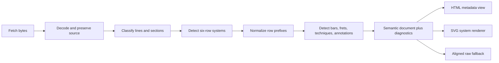

# ASCII Guitar Tablature: Corpus Analysis, Parsing, and Browser Rendering

Status: implementation guide based on the seven files in `pages/tabs/` and on
the external specifications listed in [Sources](#sources). Research and corpus
analysis performed 2026-07-20.

## 1. Purpose and scope

The `*.tab.txt` files under `pages/tabs/` are not ordinary prose documents.
They are informal, fixed-column guitar tablatures mixed with free-form metadata,
performance instructions, navigation marks, and file-specific legends. Their
layout is part of their meaning: a character's horizontal column relates it to
notes, beats, barlines, and annotations on adjacent rows.

This document defines:

- how a six-string guitar tablature is read;
- what is actually present in this repository's seven examples;
- which conventions are dependable and which are ambiguous;
- a lossless, tolerant parsing strategy;
- a compact TypeScript data model;
- a browser architecture for an attractive graphical renderer; and
- authoring and validation rules for future files.

It does **not** define a new universal tablature standard. ASCII tablature is a
human-oriented family of conventions rather than one strict grammar. Even
TablEdit's official import workflow asks for time signature, measure width,
prefix width, and inter-measure spacing, which demonstrates that these values
cannot always be recovered from text alone. See the official
[TablEdit ASCII import documentation](https://tabledit.com/help/english/import_ascii.shtml).

## 2. Executive conclusions

1. Preserve source columns before interpreting music. Never `trim()`, wrap,
   collapse spaces, normalize punctuation, or use a proportional font on the
   source representation.
2. A playable system is normally six consecutive rows ordered from the high,
   thin first string at the top to the low, thick sixth string at the bottom.
   Labels are optional after the first system.
3. Digits are fret positions, not note names. `0` is an open string. The pitch
   therefore depends on both string number and tuning.
4. Simultaneous vertical alignment usually means a chord or simultaneous
   voices. Horizontal movement is chronological, but spacing is not reliably an
   exact duration unless the file provides a beat or duration ruler.
5. The corpus uses several incompatible row prefixes and many local symbols.
   Parsing must be tolerant, diagnostic, and lossless rather than based on one
   rigid regular expression.
6. The recommended UI is semantic HTML for prose and metadata plus one SVG per
   tab system. SVG gives precise geometry, responsive vector output, selectable
   labels, printable results, and better accessibility than a canvas-only UI.
7. Unknown notation must remain visible in an aligned fallback layer and produce
   a diagnostic. Silently deleting or guessing it can change how a musician
   plays the piece.
8. Exact playback is out of scope for the first engine. These files usually do
   not encode enough rhythmic information to reconstruct authoritative audio.

## 3. Corpus inventory and raw-file facts

All seven files were read in full. They are 7-bit ASCII, contain no byte-order
mark, and use LF line endings. Because ASCII is a subset of UTF-8, all seven are
valid UTF-8. Source rows include leading spaces and, in several files, trailing
spaces that may carry alignment. Two literal tab characters occur, but only in
header/blank content, not inside a six-row music system.

The line counts below exclude the final empty item created by a terminating
newline. “Systems” means playable six-row systems; `abmcat2z.tab.txt` also has a
six-row notation legend and a decorative six-row credit block.

| File | Bytes | Lines | Maximum source columns | Playable systems | Declared meter | Tuning evidence |
|---|---:|---:|---:|---:|---|---|
| `abmcat2z.tab.txt` | 6,037 | 158 | 70 | 13 | 4/4 | Main rows say `E B G D A E`; its legend says low `D`, so the sixth string is ambiguous |
| `alvv1tat.tab.txt` | 11,855 | 240 | 77 | 20 | 3/4 | Labeled `E B G D A E` |
| `jsb1006p.tab.txt` | 28,536 | 474 | 89 | 51 | 3/4 | First system labeled `E B G D A E`; later systems inherit it |
| `ml9cdl.tab.txt` | 5,939 | 144 | 77 | 14 | 4/4 | Explicit sixth string tuned to `D`; rows are `E B G D A D` |
| `mletda.tab.txt` | 2,453 | 51 | 86 | 4 | 3/4 | Explicit “D tuning”; rows are `e B G D A D` |
| `rbaubad.tab.txt` | 3,392 | 77 | 81 | 7 | 3/4 | Not stated and rows are unlabeled; standard tuning is plausible but unproven |
| `rbromanc.tab.txt` | 2,895 | 49 | 77 | 5 | 4/4 | Explicit `E A D G B E` low-to-high in German header text |

### 3.1 Shared characteristics

- Six visually parallel rows represent six guitar strings.
- Top-to-bottom row order is high string to low string.
- Numbers represent frets and `0` represents an open string.
- `-` and spaces provide the horizontal timeline and visual string line.
- `|` commonly marks a measure boundary; doubled or starred bars may mark
  section and repeat boundaries.
- Notes vertically aligned across rows normally sound together.
- Blank lines separate music systems and prose sections.
- Metadata and directions are free-form rather than machine-keyed.
- The original column grid carries more information than punctuation alone.

### 3.2 Important differences

The row prefix is not consistent:

```text
E-|...      labeled string, hyphen, bar
E|...       labeled string and bar
e:...       labeled string and colon
||...       unlabeled double bar
|*...       unlabeled repeat bar
|...        unlabeled single bar
----...     continuation row with no opening bar or label
```

Other differences include:

- standard versus dropped-sixth-string tuning;
- labels on every system, labels only once, or no labels at all;
- fixed beat rulers, proportional spacing, or no rhythmic guide;
- inline technique letters versus words above the staff;
- left-hand fingering rows beneath a system;
- repeated music written out versus compact repeat/coda navigation;
- standard-looking conventions and author-defined symbols in the same file; and
- tab-shaped material that is a legend or decorative credit, not playable music.

## 4. How to read six-string guitar tablature

### 4.1 Coordinate system and string order

The top row is string 1, the thinnest and highest-pitched string. The bottom row
is string 6, the thickest and lowest-pitched string. MusicXML uses the same
string numbering: string 1 is the highest string, and fret 0 is open. See the
[MusicXML tablature tutorial](https://www.w3.org/2021/06/musicxml40/tutorial/tablature/).

Standard classical-guitar tuning is:

| Display row | String number | Open pitch | Scientific pitch |
|---:|---:|---|---|
| 1, top | 1 | high E | E4 |
| 2 | 2 | B | B3 |
| 3 | 3 | G | G3 |
| 4 | 4 | D | D3 |
| 5 | 5 | A | A2 |
| 6, bottom | 6 | low E | E2 |

The official MusicXML example specifies these same open pitches in its six
`staff-tuning` elements. A tuning describes the open, non-capo pitch; see
[MusicXML `staff-tuning`](https://www.w3.org/2021/06/musicxml40/musicxml-reference/elements/staff-tuning/).
In drop-D tuning, only string 6 changes from E2 to D2.

Do not infer standard tuning merely because a file has six rows. Use, in order:

1. an explicit tuning declaration;
2. labels on the first confident system;
3. a preceding system's established tuning; or
4. an `unknown` tuning with a visible warning.

The conflict in `abmcat2z.tab.txt` is a concrete reason not to guess.

### 4.2 Frets, events, and chords

- `0` means pluck the string open.
- `1`, `2`, … mean press that string immediately behind the numbered fret and
  pluck it.
- `10`, `11`, `12`, … are one multi-digit fret token, not two events.
- Events on different strings with the same onset column form a chord or
  simultaneous voices.
- Events further right occur later.
- An empty string row at a moment means that string is not newly attacked; it
  does not necessarily mean an earlier note has stopped ringing.

Tablature identifies *where* to play. It does not inherently identify a written
note name, because the resulting pitch is derived from tuning + string + fret.
This position-first model is also how MusicXML represents tab with separate
`string` and `fret` values.

### 4.3 Rhythm and timing

The examples provide three levels of timing information:

1. **Declared meter only** — for example `3/4 time`.
2. **Beat ruler** — aligned `|` characters above the strings show beat
   positions, as in `abmcat2z.tab.txt` and `rbromanc.tab.txt`.
3. **Horizontal spacing only** — event distance suggests timing but is not a
   formal tick grid.

MusicXML explicitly notes that tablature often provides direct string/fret
guidance at the expense of precise rhythm. TablEdit can export a configured
number of characters per beat, or proportional spacing with duration letters,
but ordinary files do not have to use either mode. Its documented duration
letters are `w`, `h`, `q`, `e`, `s`, and `t` for whole through thirty-second
notes. See [TablEdit ASCII export](https://tabledit.com/help/english_m/export_ascii.shtml).

None of the repository files supplies a complete, unambiguous duration stream.
The engine may visualize relative source spacing but must label inferred rhythm
as approximate. Do not schedule authoritative playback from columns alone.

## 5. Notation observed in this corpus

The following meanings are corpus-aware. A parser should match case-insensitively
where the examples vary (`p`/`P`) but retain the original spelling for display.

| Source form | Meaning in these files | Parsing/rendering rule | Confidence |
|---|---|---|---|
| `0` | Open string | Fret event with `fret: 0` | High |
| `1`–`19` | Fretted note | Consume consecutive digits as one fret token | High |
| `-` | String line / horizontal spacing | Geometry, not an event and not proof of duration | High |
| space | Alignment or separation | Preserve columns; do not collapse | High |
| `|`, `||` | Bar or section boundary | Derive a shared barline by consensus across rows | High |
| `|*`, `*|` | Repeat boundary | Render repeat dots/bar when shared across rows | High in `rbromanc` |
| `h`, `H` between/near frets | Hammer-on | Same-string technique edge between adjacent fret events | High when two endpoints exist |
| `p`, `P`, `poff`, `pulloff` | Pull-off | Same-string technique edge; accept long spellings | High when two endpoints exist |
| `/` between frets | Ascending slide | Connect source and destination fret graphically | High in the music rows |
| `/` after `C7-----` | End of a barre span | Annotation terminator, **not** a slide | High from context |
| `<7>`, `<12>`, `<n>` | Harmonic | Harmonic fret event; use diamond/halo styling | High; explained locally and consistent with surrounding `harmonics` text |
| `=` following a fret | Sustain / let ring | Extend a sustain line from the event | High in `abmcat2z`, whose legend defines it |
| vertically alternating `(` and `)` | Arpeggiate chord | Draw a vertical arpeggio mark | High only in the `abmcat2z` legend |
| `C7`, `C5`, etc. above a system | Barre at that fret | Aligned annotation with horizontal extent | High in this corpus; `abmcat2z` defines the convention |
| digits `1`–`4` below six rows | Left-hand fingering | Annotation, not fret events | High in `alvv1tat` |
| `r(5`, `r(1`, etc. | File-specific pizzicato instruction | Use the local legend; display specially but do not generalize to other files | High only in `mletda` |
| `%`, `$`, `To Coda`, `D.S.`, `Fine` | Navigation | Structural marker attached to nearest measure | High in `rbaubad` |
| `>1`, `>2`, `>3`, `FIRST/SECOND ENDING` | Alternate ending / pass marker | Section annotation; do not treat `>` as harmonic syntax | Medium to high from context |
| `Allegro`, `expressivo`, `harmonics...`, `Oct.` | Performance direction | Preserve as aligned text; semantic subtype where known | Medium |
| `{` after fret tokens | Undocumented export-specific mark | Preserve raw, flag `unknown-symbol`, do not invent a meaning | Unknown |

### 5.1 Context is essential

The same ASCII character can mean different things:

- `/` is a slide inside `5/6`, a barre-span terminator after `C7----/`, and part
  of a URL in metadata.
- `p` is a pull-off between frets but an ordinary letter in prose.
- `1` can be a fret in a string row, a left-hand finger beneath the staff, a
  measure/ending number above it, or metadata text.
- `<...>` is a harmonic token inside a staff but an email-address delimiter in
  a header.
- `|` is a string/bar character in a system and a beat marker in an annotation.

Tokenize only after document segmentation and row classification.

## 6. Per-file analysis

### 6.1 `abmcat2z.tab.txt` — La Catedral, second movement

- Structured header with title, composer, transcriber, URL, movement, key, and
  4/4 meter.
- Thirteen playable systems with labels on all six rows.
- Beat markers are aligned above systems.
- Uses slides (`7/11`), hammer-ons, pull-offs, harmonics (`<7>`, `<12>`), and
  sustain (`=`).
- Contains its own illustrated notation legend and a `C<number>` barre rule.
- Contains a six-row decorative credit block that superficially resembles tab.
- Main music labels the lowest row `E`, while the legend labels it `D`; expose
  this as a tuning conflict rather than silently choosing one.

This file proves that “six consecutive pipe-and-dash rows” is insufficient as a
music classifier. Section context, note density, and alphabetic density are also
needed.

### 6.2 `alvv1tat.tab.txt` — Tatiana

- Header declares Allegro, 3/4, and D major.
- Twenty systems; much of each half is written twice rather than represented
  solely with repeat marks.
- Labels every string row using `E-|` style.
- Barre spans (`C7`, `C5`) appear above systems.
- One or more extra aligned rows below each system contain left-hand finger
  numbers. These must stay attached to the system but outside the six strings.
- `FIRST ENDING`, `SECOND PART`, and `ENDING 2.` appear beside or after rows,
  showing that annotations can extend past the apparent closing bar.
- Uses both lowercase and uppercase pull-off letters.

### 6.3 `jsb1006p.tab.txt` — Bach BWV 1006a prelude

- Largest file: 474 lines and 51 playable systems.
- Email-style metadata and prose precede the music.
- Only the first system carries `E||`/`B||`/… labels. Every later system is six
  unlabeled continuation rows beginning with dashes.
- Mostly fret numbers and barlines, with a hammer/pull sequence near the end.
- Contains many space-only or trailing-space rows used as visual separators.
- Its long regular sequence makes it an important fixture for continuation
  inheritance, performance, and avoiding accidental O(n²) parsing.

### 6.4 `ml9cdl.tab.txt` — Cançó del Lladre

- Header includes arrangement history, key, 4/4 meter, and explicit low-D
  tuning.
- First system is labeled `E| B| G| D| A| D|`; later systems use bare `|` rows.
- Uses both compact (`h`) and word forms (`poff`, `pulloff`) for techniques.
- Extensively uses angle-bracket harmonic tokens and aligned `harmonics...`
  spans.
- Includes `expressivo` and `Oct.` directions.
- Some technique text is irregular, such as a standalone `h`; unresolved
  endpoints should become diagnostics instead of parse failures.

### 6.5 `mletda.tab.txt` — El Testament de Amelia

- Very long systems (up to 86 columns), colon prefixes, and explicit D tuning.
- Four playable systems, each continuously spanning many events with few
  internal visual breaks.
- Uses slides and an author-defined `r(` pizzicato notation.
- The local legend says `r(5` is executed twelve frets above the written number
  (17th fret for written 5). This semantic rule belongs to this document; it is
  not a safe global ASCII-tab rule.

### 6.6 `rbaubad.tab.txt` — Aubade

- Starts with a legacy usage notice, email metadata, title, attribution, and
  3/4 meter.
- Seven unlabeled systems, using `||` at major boundaries.
- Uses compact repeat/navigation language: segno-like `%`, coda `$`, `To Coda`,
  `DS % al Coda`, and `Fine`.
- Uses `h` and `p` for legato techniques.
- No reliable tuning statement or row labels; keep tuning unknown unless a
  human supplies it.

### 6.7 `rbromanc.tab.txt` — Romance

- Header is partly German and explicitly declares tuning, E minor, and 4/4.
- Five unlabeled systems exported by TablEdit.
- Beat rulers above each system, repeat markers `|*`/`*|`, pull-off, and pass or
  ending labels `>1`, `>2`, `>3`.
- Contains `{` after several final chord notes without a local legend. Research
  did not establish a dependable generic meaning, so it must remain an unknown
  source symbol in the first parser version.

## 7. Lossless source contract

The raw source is authoritative. Semantic output is an interpretation layered
over it.

### 7.1 Required preservation

Retain:

- original decoded text;
- detected encoding and BOM;
- original newline style and final-newline presence;
- every source line, including empty and space-only lines;
- leading and trailing spaces;
- literal tabs and their chosen expansion width;
- 1-based source line and display-column spans for every parsed item; and
- raw spelling/case of every token and annotation.

Do not apply:

- `trim()` or `trimEnd()` to stored source rows;
- HTML whitespace collapsing;
- automatic word wrapping inside a source system;
- Unicode normalization to the source copy;
- smart-quote or dash substitution;
- tabs-to-spaces conversion without recording the mapping; or
- musical “corrections” during parsing.

### 7.2 Columns and tab expansion

For the current ASCII corpus, one byte, one code unit, and one display cell are
equivalent except for U+0009 TAB. Expand tabs deterministically for analysis,
using tab stops rather than a fixed number of spaces:

```ts
export function expandTabs(line: string, tabSize = 8): string {
  let column = 0;
  let expanded = "";

  for (const character of line) {
    if (character !== "\t") {
      expanded += character;
      column += 1;
      continue;
    }

    const spaces = tabSize - (column % tabSize);
    expanded += " ".repeat(spaces);
    column += spaces;
  }

  return expanded;
}
```

CSS defines preserved tab stops through `tab-size` and starts from an initial
value of eight; see [CSS Text Level 3](https://www.w3.org/TR/css-text-3/).
Record the selected tab size in diagnostics because an unknown legacy editor
could have used another value.

For future non-ASCII metadata, distinguish source offsets from display columns.
Tab-system bodies should remain ASCII unless a formal width policy is added;
emoji, combining marks, and East Asian full-width characters do not satisfy the
one-character/one-cell assumption.

## 8. Parsing architecture

Use a small functional pipeline. Loading, decoding, parsing, interpretation,
and rendering are separate concerns. The parser receives text and options; it
does not fetch URLs or manipulate the DOM.



### 8.1 Phase 1: load and decode

1. Fetch as `ArrayBuffer`, not immediately as text, so encoding evidence and BOM
   are available.
2. Enforce a reasonable size limit and check HTTP status.
3. Detect UTF-8 BOM, UTF-16 BOMs, and strict UTF-8.
4. The current corpus decodes as UTF-8/ASCII. If a future file is invalid UTF-8,
   require an explicit configured legacy encoding or report a fatal diagnostic;
   do not silently replace bytes with U+FFFD.
5. Record newline style before normalizing a parser copy to `\n`.

### 8.2 Phase 2: classify source regions

Classify each line provisionally as one of:

```ts
type LineKind =
  | "blank"
  | "prose"
  | "heading"
  | "metadata"
  | "tab-row-candidate"
  | "aligned-annotation-candidate";
```

Classification is evidence, not a final parse. URLs, email addresses, legal
notices, and legend diagrams can contain the same punctuation as tab.

Useful metadata patterns include case-insensitive `Title:`, `Author:`,
`Subject:`, `From:`, `Key:`, `Key Signature:`, `Time Signature:`, `Takt:`,
`Stimmung:`, `tuning`, `Tabbed by`, `Tablature by`, and `Transcription by`.
Store both recognized fields and untouched free text. Do not require a header
schema that these files do not have.

### 8.3 Phase 3: find six-row systems

Scan linearly for windows of six adjacent row candidates. A candidate row
normally:

- begins with a supported label/prefix, `|`, `||`, `|*`, or `-`;
- contains several string-line characters (`-`, `|`, `:`);
- contains only a modest amount of alphabetic text; and
- has a width reasonably close to its five neighbors.

Score a six-row window rather than accepting/rejecting on one regex:

- strong positive: exactly six adjacent rows;
- positive: consistent prefix family and similar widths;
- positive: numeric fret tokens on one or more rows;
- positive: shared bar columns across at least four rows;
- positive: it follows a known music system;
- negative: high prose-letter density;
- negative: a surrounding `Explanation`, `Legend`, or credit heading;
- negative: URL/email-like text;
- negative: no plausible fret in the whole block.

High-scoring blocks become `music`; medium-scoring blocks become `diagram` with
a warning; low-scoring blocks remain prose. This keeps the `abmcat2z` legend and
credit block from silently entering the playable score.

### 8.4 Phase 4: normalize row prefixes

A useful prefix recognizer is intentionally narrow:

```ts
const LABELED_PREFIX = /^(?<label>[EADGBe])(?<dash>-?)(?<bar>\|\||\||:)/;
const UNLABELED_PREFIX = /^(?<bar>\|\||\|\*?|\|)/;
```

If neither matches but six continuation rows begin with `-`, treat column zero
as the body start and inherit string identities from the previous system.

For every row keep:

- `raw`: the untouched row;
- `expanded`: tab-expanded row;
- `prefix`: exact consumed source prefix;
- `bodyStartColumn`: display column of the musical body;
- `body`: source-aligned body; and
- inferred string number and tuning, each with confidence/provenance.

The order of a confident six-row group is always assigned 1 through 6 from top
to bottom. A visible label is tuning evidence, not the string number itself.

### 8.5 Phase 5: bar and measure detection

Collect `|` positions from all six normalized bodies. A column is a confident
barline when at least four rows agree; six-row agreement is ideal. Recognize
adjacent forms such as `||`, `|*`, and `*|` as one structural boundary with a
style.

Do not use `/` as a bar. Do not split at a `|` found only in an annotation. If
rows disagree by one column, preserve the source positions and emit a
`misaligned-barline` diagnostic; an optional visual repair may use their median
without altering the source model.

Measure numbers should be sequential renderer metadata unless the source gives
explicit numbers. Repeats and codas make linear playback order different from
visual measure order, so keep navigation markers separate from measures.

### 8.6 Phase 6: event and technique scanning

Scan each musical body left to right using longest-token-first rules:

1. file-local token such as `r(\d+)`;
2. harmonic `<\d+>`;
3. multi-digit fret `\d+`;
4. long technique words `pulloff` and `poff`;
5. one-character technique connectors `h`, `p`, `/`, `=`;
6. repeat/bar tokens; and
7. unknown non-spacing symbols.

Use the first digit's column as the source onset anchor. Preserve the full token
width, then group events on different strings as simultaneous when their onset
anchors agree. A one-column tolerance may be offered only as a low-confidence
repair because authors sometimes center a one-digit fret under a two-digit fret.

Technique connectors should reference endpoints, not exist only as decorative
characters:

```ts
type Technique =
  | { kind: "hammer-on"; fromEventId: string; toEventId: string }
  | { kind: "pull-off"; fromEventId: string; toEventId: string }
  | { kind: "slide"; fromEventId: string; toEventId: string }
  | { kind: "sustain"; fromEventId: string; toColumn: number }
  | { kind: "unknown"; raw: string; span: SourceSpan };
```

If one endpoint is absent, retain an unresolved technique with its raw span and
emit a warning. Never discard the containing system.

### 8.7 Phase 7: aligned annotations

Nonblank lines immediately above or below a system may be attached as aligned
annotations. Preserve their columns as spans even when semantics are unknown.
Recognize only high-value cases initially:

- beat rulers;
- barre spans;
- left-hand fingering rows;
- dynamics/tempo text;
- harmonic/ottava spans;
- first/second endings; and
- segno, coda, D.S., and Fine navigation.

Everything else is `kind: "text"`. This is safer and smaller than a plugin
framework for every historical author's vocabulary.

## 9. Recommended TypeScript model

Use readonly data, discriminated unions, and source spans. Plain objects and pure
functions are sufficient; classes and inheritance add no value here.

```ts
type Confidence = "certain" | "probable" | "uncertain";

interface SourceSpan {
  readonly startLine: number;   // 1-based
  readonly endLine: number;
  readonly startColumn: number; // 0-based expanded display column
  readonly endColumn: number;   // exclusive
}

interface Diagnostic {
  readonly severity: "info" | "warning" | "error";
  readonly code:
    | "unknown-symbol"
    | "unknown-tuning"
    | "conflicting-tuning"
    | "incomplete-system"
    | "misaligned-barline"
    | "unresolved-technique"
    | "ambiguous-rhythm"
    | "encoding-error";
  readonly message: string;
  readonly span?: SourceSpan;
}

interface OpenString {
  readonly string: 1 | 2 | 3 | 4 | 5 | 6;
  readonly step: "A" | "B" | "C" | "D" | "E" | "F" | "G";
  readonly octave?: number;
  readonly confidence: Confidence;
  readonly source?: SourceSpan;
}

interface FretEvent {
  readonly id: string;
  readonly kind: "fret";
  readonly string: 1 | 2 | 3 | 4 | 5 | 6;
  readonly fret: number;
  readonly harmonic: boolean;
  readonly onsetColumn: number;
  readonly raw: string;
  readonly span: SourceSpan;
}

interface TabRow {
  readonly string: 1 | 2 | 3 | 4 | 5 | 6;
  readonly label?: string;
  readonly prefix: string;
  readonly raw: string;
  readonly bodyStartColumn: number;
  readonly events: readonly FretEvent[];
  readonly unknownTokens: readonly SourceSpan[];
}

interface TabMeasure {
  readonly visualNumber: number;
  readonly startColumn: number;
  readonly endColumn: number;
  readonly leftBar: "single" | "double" | "repeat" | "none";
  readonly rightBar: "single" | "double" | "repeat" | "none";
}

interface AlignedAnnotation {
  readonly kind:
    | "beats"
    | "barre"
    | "fingering"
    | "direction"
    | "navigation"
    | "text";
  readonly raw: string;
  readonly span: SourceSpan;
  readonly confidence: Confidence;
}

interface TabSystem {
  readonly kind: "music" | "diagram";
  readonly rows: readonly [TabRow, TabRow, TabRow, TabRow, TabRow, TabRow];
  readonly measures: readonly TabMeasure[];
  readonly techniques: readonly Technique[];
  readonly annotationsAbove: readonly AlignedAnnotation[];
  readonly annotationsBelow: readonly AlignedAnnotation[];
  readonly widthColumns: number;
  readonly span: SourceSpan;
}

interface TabDocument {
  readonly sourceName: string;
  readonly rawText: string;
  readonly encoding: string;
  readonly newline: "lf" | "crlf" | "cr" | "mixed";
  readonly metadata: Readonly<Record<string, string>>;
  readonly tuning: readonly OpenString[];
  readonly sections: readonly (
    | { kind: "prose"; text: string; span: SourceSpan }
    | { kind: "systems"; systems: readonly TabSystem[] }
  )[];
  readonly diagnostics: readonly Diagnostic[];
}
```

The exact union may grow when real files demand it. Do not add abstractions for
effects absent from the corpus.

## 10. Browser rendering architecture

### 10.1 Renderer choice

| Technique | Strengths | Weaknesses | Use here |
|---|---|---|---|
| `<pre>` + monospace | Exact raw fallback, searchable, trivial | Still looks like source text; hard to style semantic events | Required fallback/debug view, not the primary UI |
| HTML/CSS grid | Native semantics and easy controls | Large node count; technique curves and cross-row geometry are awkward | Metadata, prose, toolbars, diagnostics |
| SVG | Exact coordinates, lines/curves/text, scalable, printable, inspectable | More DOM than canvas; needs explicit accessibility | **Recommended for each tab system** |
| Canvas | Fast bitmap drawing for huge/animated scores | Harder accessibility, selection, print, hit testing, and high-DPI handling | Later only if profiling proves SVG insufficient |

SVG's `viewBox` maps a stable user coordinate system into a viewport, and its
`text`/`tspan` elements support explicit coordinates. See
[SVG coordinate systems](https://www.w3.org/TR/SVG/coords.html) and
[SVG text](https://www.w3.org/TR/SVG2/text.html).

Canvas is not warranted for this corpus: the largest file has 51 small systems.
The HTML standard also requires meaningful fallback content for canvas, adding
work that an SVG-first implementation avoids. See the
[WHATWG canvas specification](https://html.spec.whatwg.org/multipage/canvas.html).

### 10.2 Component boundaries

A compact React implementation can use:

```text
src/tab/
  types.ts                 shared contracts only
  decodeTab.ts             bytes -> preserved text
  parseTab.ts              pure text -> TabDocument
  tabDiagnostics.ts        messages and confidence helpers
  TabDocumentView.tsx      metadata, sections, controls
  TabSystemSvg.tsx         one six-string SVG system
  TabRawView.tsx           exact aligned fallback
```

Keep network loading in the existing catalogue/data layer. Pass decoded content
into `parseTab`; pass the resulting document into React. This makes the parser
framework-independent and easy to test without introducing a service hierarchy
or dependency-injection container.

### 10.3 System geometry

Use source columns as the initial horizontal coordinate system:

```ts
const xForColumn = (column: number) => leftPadding + column * columnWidth;
const yForString = (string: number) => topPadding + (string - 1) * stringGap;
```

Recommended first-pass geometry:

- `columnWidth`: 10–13 SVG units;
- `stringGap`: 18–22 units;
- `leftPadding`: enough for string number and tuning label;
- `topPadding`: derived from the number of attached annotations;
- width: `leftPadding + widthColumns * columnWidth + rightPadding`;
- height: annotations + five string gaps + bottom annotations.

Draw in this order:

1. subtle system background and measure hover regions;
2. six horizontal string lines;
3. barlines and repeat marks;
4. small background knockouts at fret positions;
5. fret/harmonic numbers;
6. hammer/pull curves, slide lines, sustain lines, and arpeggio marks;
7. barre, beat, fingering, dynamic, and navigation annotations;
8. unknown source symbols in a warning-colored but non-destructive overlay.

Fret text should be centered on its onset, while its background knockout is
sized to the actual token (`9` versus `12`). Do not rely on font glyph advance
for staff alignment; the semantic x coordinate comes from the source column.

### 10.4 Responsive layout

Never allow the browser to wrap a system at an arbitrary character. Use one of:

1. **Preferred:** reflow only at high-confidence measure boundaries, placing one
   or more whole measures into a new SVG system.
2. **Fallback:** keep the original system intact in a horizontally scrollable
   viewport with zoom controls.

Reflow must move aligned annotations and techniques with their measures. If an
annotation crosses the proposed break or bars are uncertain, keep the original
system intact. A tablature is a two-dimensional diagram, so limited horizontal
scrolling can be necessary for meaning, but zoom and measure-level reflow should
minimize it. WCAG 2.2 recognizes an exception for content whose meaning requires
a two-dimensional layout; see [WCAG 2.2, Reflow](https://www.w3.org/TR/WCAG22/#reflow).

### 10.5 Visual language

Match the application's restrained codex style without reducing legibility:

- light ivory/parchment system surface;
- dark brown string lines and fret numerals;
- burgundy for active measure, navigation, and warnings;
- muted gold for harmonics, barres, and focus accents;
- serif typography for title/prose;
- a clear sans-serif or tabular numeric face for graphical fret labels;
- very limited texture behind, never through, the staff;
- no heavy shadow, neon glow, or animated ornament around the music.

Use CSS custom properties so the renderer has no hard dependency on one theme.
Provide print styles with a white background and near-black notation.

### 10.6 Raw fallback styling

The raw view still needs correct fixed-width rendering:

```css
.tab-raw {
  overflow-x: auto;
  white-space: pre;
  tab-size: 8;
  font-family: "Tab Source", ui-monospace, monospace;
  font-variant-ligatures: none;
  font-kerning: none;
  letter-spacing: 0;
}
```

CSS defines `monospace` as the generic fixed-width family and enables common
ligatures by default in fonts unless overridden, so explicitly disabling optional
ligatures avoids surprising glyph substitution. See
[CSS Fonts Level 4](https://www.w3.org/TR/css-fonts-4/) and the fixed-width
definition in [CSS Fonts Level 3](https://www.w3.org/TR/css3-fonts/).

### 10.7 Interaction

Keep the initial interaction set small:

- zoom in/out/reset;
- original-layout/responsive-layout toggle;
- graphical/raw toggle;
- measure hover/focus highlighting;
- optional click on a fret to show “string 2, fret 7” and calculated pitch when
  tuning is known; and
- diagnostics panel for ambiguous tuning or symbols.

Do not add playback, an editor, MIDI export, fretboard animation, or a symbol
plugin system until a real requirement and sufficient rhythmic data exist.

## 11. Accessibility, security, and performance

### 11.1 Accessibility

- Render title, composer, tuning, meter, directions, and explanatory prose as
  semantic HTML.
- Wrap each SVG system in `<figure>` with a visible `<figcaption>` such as
  “Systems 4–5, measures 9–14”.
- Give inline SVG an accessible `<title>` referenced by `aria-labelledby`.
  W3C's SVG guidance recommends this pattern; see
  [WAI SVG tips](https://www.w3.org/WAI/tutorials/images/tips/).
- Provide a compact text alternative generated from semantic events, for
  example “Measure 3: string 6 open; strings 3/2/1 frets 0/0/3 together”.
- Keep the exact raw view available, but do not make a screen reader traverse
  hundreds of decorative dashes by default.
- Controls must be native buttons with visible focus and accessible names.
- Never communicate harmonic, warning, or active state by color alone.
- Respect browser zoom, reduced motion, and high-contrast/forced-colors modes.

### 11.2 Security

- Treat every file as untrusted text.
- Insert text with React text nodes or `textContent`, never `innerHTML`.
- Parse header URLs with `new URL()` against an allowed base and permit only
  intended protocols (`https:` and, if required, `mailto:`).
- Do not automatically fetch URLs mentioned inside old files.
- Apply file-size, line-count, line-width, and fret-range limits with diagnostics
  rather than uncontrolled allocation.
- Avoid regular expressions with nested ambiguous repetition on entire files;
  scan linearly and tokenize one row at a time.

### 11.3 Performance

The corpus is small enough for synchronous parsing on load. Keep the algorithm
approximately O(total characters): one pass for lines/systems and one pass for
tokens. Cache by source URL plus content hash if profiling shows repeated work.

Use one SVG per system rather than one enormous document SVG. Render document
sections progressively through normal React composition. Add virtualization or
a Web Worker only if measurements on much larger real files show main-thread
latency; they are unnecessary for the current 61 KB corpus.

## 12. Error handling and confidence

Parsing should be tolerant. Loading/decoding can fail; musical interpretation
usually should not.

Return a document plus diagnostics when at least some content can be displayed.
Reserve a fatal result for unreadable bytes, an empty response, or configured
resource-limit violations. Examples:

| Situation | Result |
|---|---|
| Five or seven possible string rows | Keep as prose/raw diagram; `incomplete-system` warning |
| Conflicting tuning labels | Keep both evidence items; `conflicting-tuning` warning |
| Unknown `{` in a row | Render aligned raw symbol; `unknown-symbol` warning |
| `h` with no destination fret | Preserve annotation; `unresolved-technique` warning |
| Barlines differ by one column | Preserve rows; median only for visual guide; warning |
| No beat ruler/duration codes | Render proportional source spacing; `ambiguous-rhythm` info |
| Malformed metadata line | Keep it as prose; no music parse failure |

Diagnostics should include source line/column and a short corrective suggestion.
They are observability for maintainers, not error banners that prevent musicians
from viewing the tab.

## 13. Verification strategy

Use the seven files as golden fixtures. The highest-value automated checks are:

### 13.1 Preservation checks

- Strict decoding succeeds for all current files.
- Rejoining stored raw lines recreates the decoded source exactly.
- No leading/trailing spaces or blank lines disappear.
- Tab expansion maps source offsets to deterministic display columns.
- Raw fallback keeps every system's barlines vertically aligned.

### 13.2 Structural checks

- Expected playable system counts are `13, 20, 51, 14, 4, 7, 5` in inventory
  order.
- Every accepted music system has exactly six ordered rows.
- `jsb1006p` inherits labels after its first system.
- `ml9cdl` and `mletda` resolve string 6 to D.
- `rbaubad` remains tuning-unknown.
- `abmcat2z` reports conflicting sixth-string evidence.
- The `abmcat2z` legend and credit block are not counted as ordinary playable
  systems.

### 13.3 Token checks

- Multi-digit frets remain single events.
- Harmonics parse without turning `<...>` metadata into events.
- `/` is a slide only inside a music row between fret endpoints.
- `C7----/` becomes a barre annotation, not a slide.
- `r(` uses only the `mletda` local rule.
- Unknown `{` remains visible and diagnosed.
- Fingering rows in `alvv1tat` do not become extra strings or fret events.

### 13.4 Visual checks

- Fret onsets and chords remain vertically aligned at 100%, 200%, and 400%
  browser zoom.
- Systems do not wrap inside a measure.
- Long systems work at narrow viewport widths through measure reflow or one-axis
  scrolling.
- Font loading does not shift event geometry.
- Print preview remains legible in monochrome.
- Keyboard navigation and screen-reader labels expose systems and controls.

Prefer small parser unit tests and a few screenshot fixtures over broad mocking.
The source corpus itself is the essential integration fixture.

## 14. Authoring rules for new `*.tab.txt` files

To retain human readability and make future parsing reliable:

1. Save as UTF-8; keep the six music rows ASCII-only.
2. Use spaces, never literal tabs, inside tab systems.
3. Declare title, composer/arranger, transcription author, time signature,
   tuning, and capo explicitly.
4. State tuning low-to-high in metadata and label rows high-to-low.
5. Use exactly six adjacent rows per guitar system.
6. Prefer one prefix style consistently, ideally `e|`, `B|`, `G|`, `D|`,
   `A|`, `E|` on every system.
7. Align barlines across all six rows.
8. Keep lines near 80 columns; 96 is a practical upper bound for modern screens.
   TablEdit's documented default is 80.
9. Include a beat ruler or explicit duration legend when timing matters.
10. Define every non-obvious or local symbol in a legend inside the file.
11. Use `h`, `p`, `/`, `<n>`, and `=` consistently; do not reuse them with a
    second meaning in music rows.
12. Place fingering and performance annotations immediately above/below their
    system and keep their columns aligned.
13. Mark repeats/endings/codas with both symbols and words when possible.
14. Keep prose and decorative ASCII art outside music systems.
15. Validate with a monospace raw preview and the graphical renderer before
    publishing.

## 15. Minimal implementation sequence

Implement in small, independently useful passes:

1. **Lossless loader and raw view** — strict decode, preserved lines, correct
   monospace fallback.
2. **System detection** — six rows, prefix variants, source spans, diagnostics.
3. **Basic SVG** — string lines, barlines, fret numbers, tuning labels.
4. **Corpus techniques** — hammer, pull, slide, harmonic, sustain, repeats.
5. **Aligned annotations** — beats, barres, fingering, directions, navigation.
6. **Responsive measure reflow and accessibility**.
7. **Only after profiling/real demand:** optimization, editing, or approximate
   playback.

After pass 3 the result is already visually attractive and useful. Later passes
enrich meaning without forcing a large architecture up front.

## 16. Acceptance criteria for the first production engine

- All seven files load without losing source characters or alignment.
- The seven expected playable-system counts match.
- Standard and drop-D tuning are displayed correctly where supported by source
  evidence; ambiguous tuning is visibly identified.
- Basic frets, chords, bars, repeats, hammer-ons, pull-offs, slides, harmonics,
  and sustain are graphical rather than raw ASCII.
- Unknown notation remains visible and links to a precise diagnostic.
- Metadata and instructions remain readable HTML and are not mistaken for tab.
- No system wraps at arbitrary characters.
- Raw source is available as a faithful fallback.
- The view is keyboard-operable, zoomable, printable, and usable on narrow
  screens.
- Parsing is linear for the current corpus and introduces no runtime library
  dependency.

## Sources

Primary and authoritative references used for this guide:

- [TablEdit Manual — Export ASCII, HTML, RTF](https://tabledit.com/help/english_m/export_ascii.shtml): page width, character-per-beat and proportional modes, duration codes, tuning/bar/beat export options, and the explicit monospaced-font requirement.
- [TablEdit Manual — Import ASCII](https://tabledit.com/help/english/import_ascii.shtml): tolerant recognition and the setup information needed to recover timing and measures from informal text.
- [TablEdit Manual — How to Export ASCII](https://tabledit.com/help/english/howtoexportascii.shtml): practical warning that hammer-ons, pull-offs, slides, and triplets can be lost or damaged during conversion.
- [TablEdit Manual — Harmonics](https://tabledit.com/help/english/harmonics.shtml): natural and artificial harmonic semantics.
- [TablEdit Manual — Slides](https://tabledit.com/help/english/slides.shtml): slide, slide-to/from-nowhere, and slide-pick distinctions.
- [TablEdit Manual — Notation Display](https://tabledit.com/help/english/notation_display.shtml): barre notation and span behavior.
- [MusicXML 4.0 — Tablature](https://www.w3.org/2021/06/musicxml40/tutorial/tablature/): string/fret model, string numbering, open fret 0, tuning, and tablature's rhythmic limitations.
- [MusicXML 4.0 — `staff-tuning`](https://www.w3.org/2021/06/musicxml40/musicxml-reference/elements/staff-tuning/): open-string tuning semantics.
- [MuseScore Studio Handbook — Creating a tablature stave](https://handbook.musescore.org/en_gb/idiomatic-notation/guitar/creating-a-tablature-staff): contemporary notation-software description of tablature as strings plus fret numbers.
- [CSS Text Level 3](https://www.w3.org/TR/css-text-3/): preserved whitespace and tab-stop behavior.
- [CSS Fonts Level 4](https://www.w3.org/TR/css-fonts-4/): generic monospace selection and ligature controls.
- [SVG 2 — Coordinate Systems](https://www.w3.org/TR/SVG/coords.html), [SVG 2 — Text](https://www.w3.org/TR/SVG2/text.html), and [SVG 2 — Accessibility Support](https://www.w3.org/TR/SVG/access): responsive vector geometry, positioned text, and accessible SVG.
- [WHATWG HTML — Canvas](https://html.spec.whatwg.org/multipage/canvas.html): canvas bitmap and fallback-content requirements.
- [WCAG 2.2](https://www.w3.org/TR/WCAG22/): reflow, contrast, keyboard, and non-text accessibility requirements.

